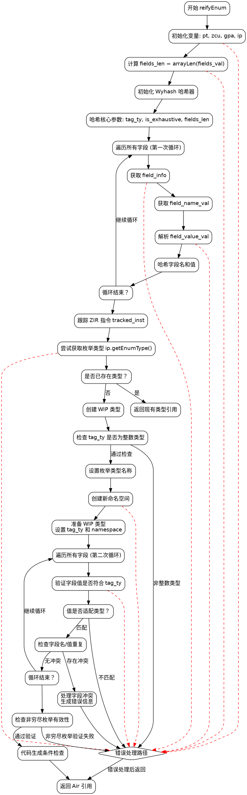

嗯，用户让我用Graphviz来画这个Zig函数的流程图。首先，我需要理解这个函数的结构和逻辑。这个函数叫做`reifyEnum`，看起来是处理枚举类型的语义分析部分。代码里有很多条件判断、循环和错误处理，这些都需要在流程图中体现出来。

首先，函数开始时会初始化一些变量，比如`pt`、`zcu`、`gpa`、`ip`。然后计算`fields_len`，接着创建一个哈希器`hasher`，用来处理枚举字段的哈希。之后遍历每个字段，获取字段名和值，并将它们加入到哈希中。

接下来，尝试获取或创建枚举类型`wip_ty`。这里有一个`switch`语句，处理`ip.getEnumType`的结果。如果是已有的类型（`.existing`），就直接返回；如果是新创建的（`.wip`），则继续设置名称、命名空间等。这部分需要注意错误处理，比如`errdefer`在失败时取消类型创建。

然后，检查`tag_ty`是否是整数类型，如果不是则报错。接着设置枚举类型的名称，创建新的命名空间，并准备类型。之后再次遍历所有字段，检查每个字段的值是否符合`tag_ty`的类型，处理重复的字段名或值，以及非穷尽枚举的特殊情况。

最后，根据配置决定是否生成代码，返回结果。

画流程图的时候，需要把这些步骤分解成节点，用条件判断和循环连接起来。比如开始节点，初始化变量，哈希处理，获取枚举类型的分支，错误处理，循环处理字段，设置类型属性，最后的代码生成判断，结束节点等。

需要注意的是，循环部分（遍历`fields_len`）会出现两次，第一次用于哈希，第二次用于验证字段值，这两个循环应该分别表示。条件判断如`tag_ty`是否为整数类型，是否重复字段，是否非穷尽枚举等，都需要用菱形判断节点。

另外，错误处理路径需要用不同的箭头表示，比如`errdefer`部分，在流程图中可能需要从各个可能出错的地方指向错误处理节点，然后退出。

可能会遇到的问题包括：确保所有条件分支都被正确表示，循环结构清晰，错误处理路径不遗漏。需要仔细检查代码中的每个`return`和`try`，确保对应的错误情况都有节点表示。

总之，流程图的结构应该从顶部开始，逐步向下，分支和循环用合适的图形表示，确保逻辑清晰，符合代码的执行流程。
================================================
