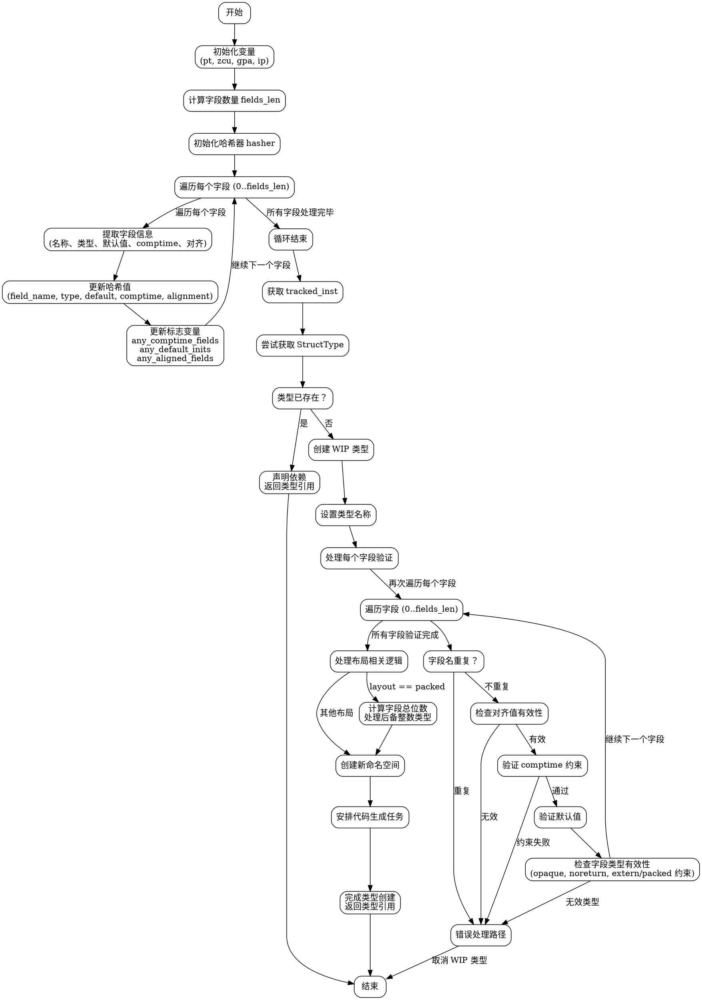

嗯，我现在需要为这个Zig函数reifyStruct画一个流程图。首先，我得仔细阅读代码，理解它的主要步骤和逻辑分支。

函数开始时，声明了一些变量，比如pt、zcu、gpa、ip等。然后处理fields_len，计算字段的数量。接下来使用Wyhash进行哈希计算，可能用于类型去重。然后遍历每个字段，提取各个属性，如名称、类型、默认值等，同时更新哈希值和一些标志变量，比如是否有comptime字段、默认初始值等。

之后，处理tracked_inst，尝试获取或创建结构体类型。如果类型已存在，就直接返回引用。否则，进入创建新类型的流程，设置名称，处理每个字段的验证，包括字段名重复、对齐检查、comptime和默认值的逻辑，以及不同布局（extern、packed）下的限制。

对于packed布局，还需要计算字段的总位数，并处理后备整数类型。最后，创建命名空间，安排代码生成任务，并返回新类型的引用。

我需要将这些步骤转化为流程图中的各个节点，包括条件判断和循环结构。比如，遍历字段的循环，处理不同布局的分支，字段验证中的各种错误检查等。同时，要注意错误处理路径，比如errdefer的使用可能对应不同的错误处理节点。

可能的结构是：开始 -> 初始化变量 -> 计算哈希 -> 遍历字段 -> 检查字段属性 -> 处理类型存在与否 -> 创建新类型 -> 处理每个字段的验证 -> 处理布局相关逻辑 -> 生成代码 -> 结束。

需要注意条件分支，比如当类型存在时直接返回，否则继续创建新类型。还有在遍历字段时的循环，每个字段的处理可能包含多个条件判断，如字段名是否重复，对齐值是否合法等。

另外，错误处理路径可能需要单独的节点，比如检查到错误时跳转到错误处理流程，释放资源等。但由于流程图主要关注主流程，可能可以简化错误处理，仅用判断框表示可能的错误出口。

总的来说，流程图需要涵盖函数的主要步骤，循环和条件分支，以及各个验证点，确保逻辑清晰，步骤明确。
================================================
