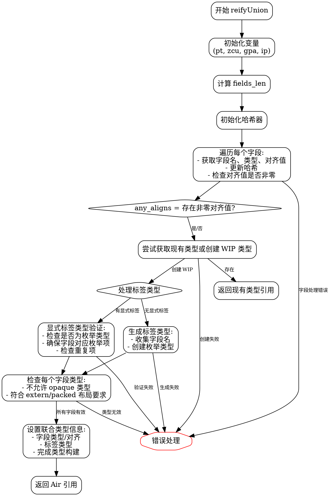

嗯，我现在需要为这个Zig函数`reifyUnion`画一个流程图。首先，我得仔细阅读代码，理解每个步骤的逻辑流程。这个函数看起来是处理联合类型的重新具体化，可能涉及到类型检查、字段验证、哈希生成、错误处理等等。

首先，函数开始部分，声明了一些变量，比如`pt`、`zcu`、`gpa`、`ip`。然后计算`fields_len`，这可能是指字段的数量。接下来用哈希器生成哈希，可能是为了类型去重。然后遍历每个字段，处理字段名、类型、对齐值，并更新哈希。这里有一个`any_aligns`的布尔变量，用来检查是否有非零的对齐值。

接下来，尝试获取或创建联合类型的WIP（Work In Progress）类型。如果已经存在，就直接返回现有类型；否则，创建一个新的WIP类型。这部分可能有条件分支，需要体现在流程图中。

然后处理枚举标签类型。如果有显式提供的标签类型，会进行验证，确保每个字段都对应枚举中的字段，并且没有重复。如果没有显式标签，就生成一个。这部分可能涉及循环检查每个字段，并在发现错误时返回失败。

之后，检查每个字段的类型是否有效，比如不能是opaque类型，以及在extern或packed布局下的限制。如果有无效类型，返回错误。

最后，设置联合类型的字段类型、对齐、标签类型，并完成类型的创建，生成代码等。

现在需要把这些步骤转化为流程图。每个主要步骤作为一个节点，条件判断作为分支，循环可能需要用循环结构或者分解成多个步骤。错误处理可能需要多个错误出口。

可能的流程步骤：

1. 开始函数。
2. 初始化变量（pt, zcu等）。
3. 计算fields_len。
4. 初始化哈希器，遍历字段生成哈希。
5. 检查是否有字段对齐值不为零，设置any_aligns。
6. 尝试获取现有类型，如果存在，返回；否则创建WIP类型。
7. 处理标签类型（显式或生成）。
   a. 显式标签：验证字段对应枚举，检查重复。
   b. 生成标签：收集字段名，生成枚举类型。
8. 检查每个字段类型是否符合布局要求（extern/packed）。
9. 设置联合类型的字段信息，完成类型。
10. 返回结果。

错误处理在每个步骤都可能出现，比如字段重复、无效类型、对齐值错误等，这些需要作为条件分支处理，指向错误返回节点。

需要确定每个判断点的条件，比如是否存在显式标签类型、字段是否有效等。循环处理字段可能需要分解为多个步骤，或者在流程图中用循环符号表示。

可能的结构图：

开始 -> 初始化变量 -> 计算fields_len -> 哈希处理字段 -> 检查any_aligns -> 获取/创建WIP类型 -> 处理标签类型 -> 检查字段类型 -> 设置类型信息 -> 完成并返回。

其中，处理标签类型分为显式和生成两种情况，需要分支。每个字段的检查可能涉及循环，但在流程图中可能需要简化为一个处理步骤，内部循环用注释说明。

此外，错误处理节点需要连接到各个可能出错的地方，比如哈希处理中的字段对齐错误、标签验证中的重复字段、类型检查中的无效类型等。

现在需要将这些步骤用Graphviz的DOT语言表示，确保节点和边的正确连接，条件分支使用菱形节点，处理步骤用矩形节点，错误处理用特殊形状或颜色标注。
================================================

该流程图使用 Graphviz 的 DOT 语言绘制，关键特征包括：

1. 菱形节点表示条件判断
2. 红色八边形表示错误处理集中出口
3. 主流程从顶部到底部流动
4. 字段遍历处理合并为一个复合节点（实际实现包含循环）
5. 显式标签验证和自动标签生成作为分支处理
6. 所有错误路径统一指向错误处理节点
7. 类型验证包含 extern/packed 布局的特殊检查
8. 哈希生成和 WIP 类型创建作为早期去重机制

可以通过 Graphviz 工具（如 dot 命令行）渲染为 PNG/SVG 等格式，示例命令：
`dot -Tpng reifyUnion_flowchart.dot -o reifyUnion_flowchart.png`