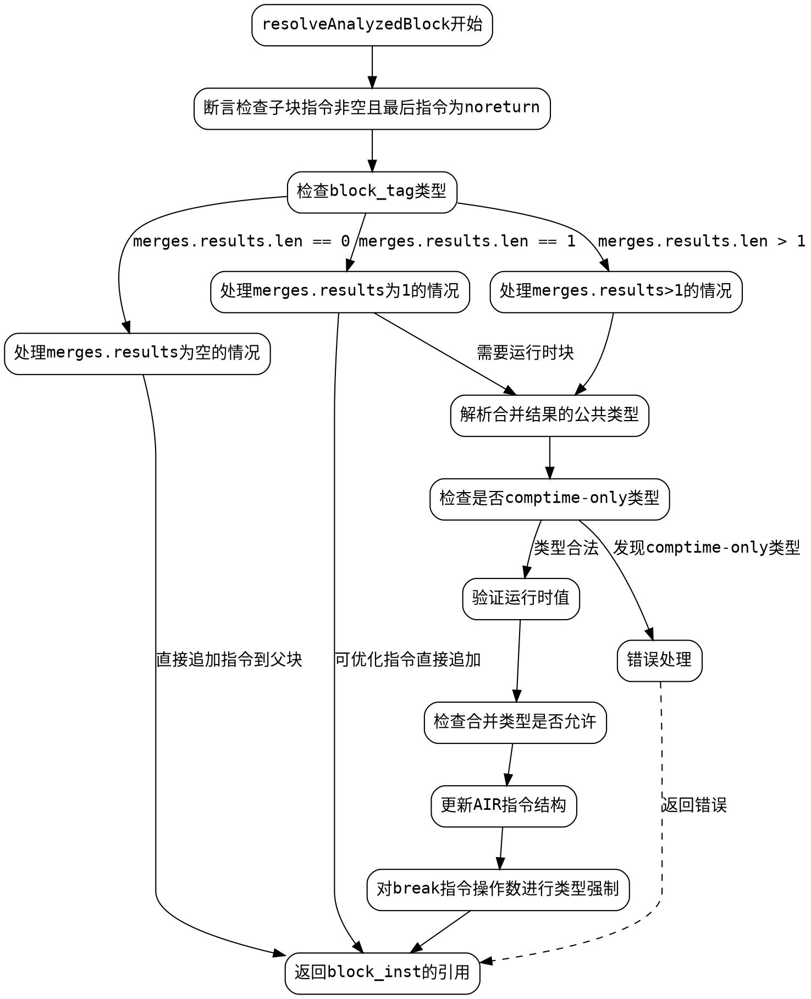

嗯，用户让我用Graphviz来画这个Zig函数的流程图，不能用Mermaid。那我得先仔细看看这段代码的结构，然后理清楚各个部分的逻辑流程。

首先，函数是resolveAnalyzedBlock，参数挺多的，返回类型是CompileError!Air.Inst.Ref。看起来是处理代码块的分析和解析，可能涉及指令的合并、类型检查之类的。

代码开始部分有一些断言，确保子块的最后一个指令是noreturn类型的。然后根据block_tag的不同情况处理不同的块类型，比如.block和.dbg_inline_block。接着处理没有合并结果的情况，或者只有一个合并结果的情况，这时候可能会优化掉一些不必要的块指令，直接把子块的指令追加到父块里。

然后是多于一个合并结果的情况，这时候需要进行类型解析，检查是否所有合并结果的类型都兼容，可能涉及到类型强制转换。这里还有一些错误处理，比如当类型只能在编译时确定，但存在运行时控制流时，会生成错误信息。

接下来是处理断点指令（br），可能需要插入类型强制转换的代码块，并调整原有的br指令指向新的块。

整个函数的逻辑分支很多，处理不同的情况需要不同的流程。画流程图的时候需要把这些条件分支都表现出来，比如merges.results.items.len的情况，block_tag的不同类型，是否需要类型强制转换等等。

可能需要先确定主要的流程节点，比如函数入口，各个条件判断，处理不同情况的代码块，错误处理，以及最终的返回。然后根据代码中的条件语句（if、switch）来连接这些节点，形成流程的分支和合并。

需要注意的是，有些部分可能涉及到循环，比如最后的for循环处理每个br指令，这时候在流程图中可能需要用循环结构表示，但Graphviz中通常用条件节点和箭头来表示循环。

另外，代码中的错误处理部分，比如返回错误信息的地方，也需要在流程图中体现出来，可能作为终止节点或者单独的分支。

可能需要将整个函数分解成几个主要部分：

1. 初始检查和断言
2. 处理没有合并结果的情况
3. 处理单个合并结果的情况
4. 处理多个合并结果的情况
5. 类型检查和错误处理
6. 调整br指令的流程

每个部分内部又有条件分支，需要用不同的节点表示。例如，处理单个合并结果时，有检查是否需要调试作用域，以及是否最后一个指令是break等条件。

同时，注意各个条件之间的连接，比如当某个条件满足时，流程转向某个处理块，否则继续下一个条件判断。

可能还需要处理函数中的递归调用，比如sema.coerce可能会触发其他分析，但这里可能不需要深入到内部，只需在流程图中表示为一个步骤。

总之，流程图需要覆盖所有主要的条件分支和处理步骤，确保逻辑清晰，各部分的连接正确。可能需要多次检查代码，确保没有遗漏重要的判断和处理流程。
================================================
