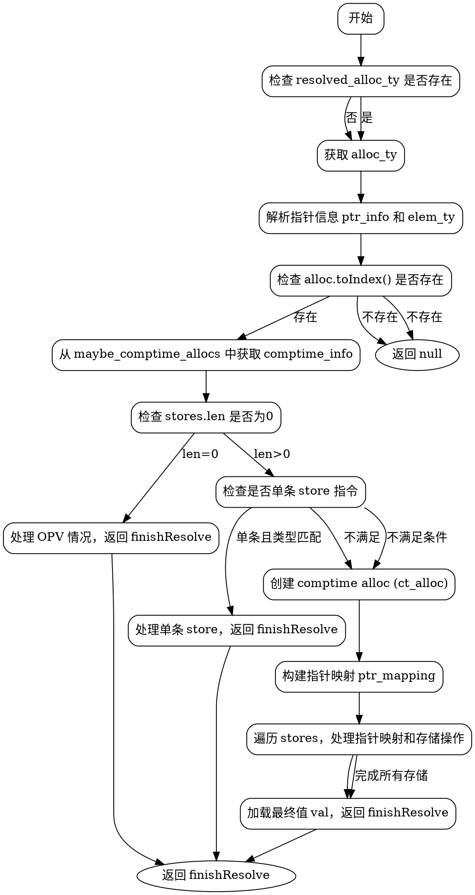

嗯，我需要为这个Zig函数`resolveComptimeKnownAllocPtr`画一个流程图。首先，我得仔细看看这个函数的结构和逻辑。

函数开始检查`resolved_alloc_ty`是否存在，如果不存在就获取`alloc`的类型。接着获取指针信息和元素类型。然后检查`alloc_inst`是否存在，并从`maybe_comptime_allocs`中移除对应的条目。如果`stores`的长度是0，处理OPV情况；否则尝试简单情况处理单个store。如果失败，创建comptime alloc，处理指针映射，然后处理所有store指令，最后加载值。

我需要把主要的流程步骤分解出来。首先，入口是函数开始，然后是各种条件判断：是否有`resolved_alloc_ty`，`stores.len`是否为0，是否为单个store，否则进入复杂处理。每个分支都应该有不同的节点。比如，当`stores.len`为0时，直接返回finishResolve...；如果是单个store，检查类型后返回；否则创建ct_alloc，处理指针映射，处理每个store，最后加载值。

需要注意的是循环和条件分支的结构，比如`while (to_map.pop())`循环处理指针映射。此外，处理不同类型的store指令（如struct_field_ptr、ptr_elem_ptr等）可能需要不同的子流程。

画图时，使用graphviz的语法，用节点和箭头连接各个步骤。需要确保条件判断的分支正确，循环结构表示清楚。可能的节点包括开始、检查stores.len、处理简单情况、创建ct_alloc、映射指针、处理每个store、最终加载值并返回。

还要注意错误处理和返回路径，比如在出现错误时可能提前返回。不过函数中大部分错误处理用了try，可能通过返回错误或null来处理，但在流程图中可能不需要特别标注，除非有特定的错误处理分支。

最后，确保流程图的结构清晰，每个步骤之间的逻辑连贯，条件分支正确标注。
================================================
