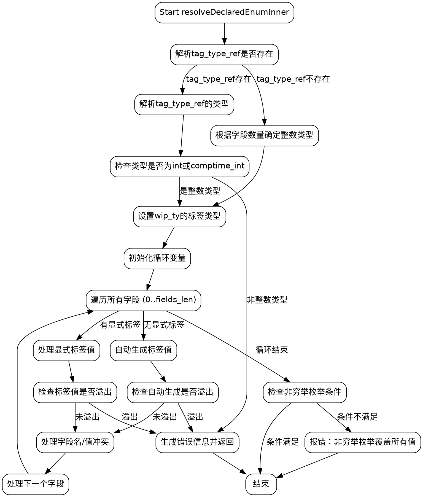

好，我需要为给定的Zig函数`resolveDeclaredEnumInner`绘制一个流程图。首先，我需要理解这个函数的主要逻辑和各个部分的结构。

函数开始部分处理了一些参数，包括解析标签类型`tag_type_ref`。如果`tag_type_ref`存在，它会解析类型并检查是否为整数类型。如果没有指定`tag_type_ref`，则根据字段数量自动确定整数类型的大小。

接下来，函数处理每个枚举字段。这里有一个循环，遍历所有字段。对于每个字段，检查是否有显式的标签值，或者是否自动生成。如果有冲突的标签值，会生成错误信息。如果标签值溢出，同样会报错。

在处理完所有字段后，检查是否为非穷举枚举，并验证标签类型是否符合条件，否则报错。

接下来，我需要将这些步骤转化为流程图的结构。流程图通常包括开始、判断节点、处理步骤、循环和结束节点。需要注意条件分支，比如是否存在`tag_type_ref`，是否处理每个字段时的不同情况，以及错误处理路径。

需要注意的是，函数中有多个条件判断，例如`if (tag_type_ref != .none)`，`if (fields_len == 0)`，以及循环内的各种条件。每个条件分支都需要在流程图中正确表示。

此外，错误处理部分，如返回错误信息，也需要作为流程的分支节点。循环部分需要正确表示循环的开始、循环体和结束条件。

最后，确保流程图的箭头正确连接各个节点，逻辑清晰，不遗漏任何重要步骤。
================================================
