好的，我需要为给定的Zig函数`resolvePeerTypesInner`绘制一个流程图。首先，我需要理解这个函数的结构和逻辑流程，这样才能正确地将其转化为Graphviz的图形表示。

首先，我会通读整个函数，了解其主要逻辑。这个函数处理多种不同的策略（PeerResolveStrategy），比如错误集合、可选类型、数组、向量、指针、函数、枚举或联合等。每个策略分支都有不同的处理逻辑，可能需要不同的流程路径。

接下来，我需要识别函数中的主要控制结构，比如循环、条件判断（switch语句）以及递归调用。例如，函数开始时遍历`peer_tys`来确定策略，然后根据不同的策略进入不同的处理分支。每个分支内部可能有进一步的循环或条件判断，甚至递归调用`resolvePeerTypesInner`自身。

然后，我需要确定每个主要步骤和决策点，并将它们转化为流程图中的节点和边。例如，函数的开始是一个循环，确定策略`s`，之后根据`s`的值进入不同的case处理。每个case内部可能有更多的判断和处理步骤，比如检查类型是否匹配、合并错误集合、处理数组长度等。

需要注意的是，由于代码中存在递归调用，流程图中可能需要表示递归的入口和出口点。此外，错误处理和返回结果也需要在流程图中体现，比如返回冲突、成功或其他错误类型。

由于代码非常复杂，包含多个嵌套的switch和循环，我需要确保流程图的结构清晰，避免交叉和混乱。可能需要将每个策略分支作为单独的子图或模块来处理，以保持整体的可读性。

在绘制流程图时，我会使用Graphviz的节点和边来表示函数的不同部分，使用条件判断作为菱形节点，处理步骤作为矩形节点，开始和结束作为椭圆形节点。递归调用可以用带箭头的边指向函数入口节点，表示重复流程。

最后，我需要验证流程图是否准确反映了函数的逻辑，确保所有分支和循环都被正确表示，没有遗漏重要的处理步骤或条件判断。
================================================

```graphviz
digraph resolvePeerTypesInner {
    graph [fontname="Arial", rankdir=TB];
    node [fontname="Arial", shape=box, style=rounded];
    edge [fontname="Arial"];

    start [label="开始 resolvePeerTypesInner", shape=ellipse];
    determine_strategy [label="遍历 peer_tys\n确定 PeerResolveStrategy"];
    check_unknown [label="策略是否 unknown?"];
    handle_unknown [label="设为 exact 策略\n过滤 noreturn/undefined 类型"];
    strategy_switch [label="根据策略分支", shape=diamond];

    error_set [label="处理 error_set 策略\n合并错误集合"];
    error_union [label="处理 error_union 策略\n解包并递归处理"];
    nullable [label="处理 nullable 策略\n检查所有 null 类型"];
    optional [label="处理 optional 策略\n解包并递归处理"];
    array [label="处理 array 策略\n验证长度和元素类型"];
    vector [label="处理 vector 策略\n统一长度并递归处理"];
    c_ptr [label="处理 c_ptr 策略\n验证指针属性"];
    ptr [label="处理 ptr 策略\n处理指针类型冲突"];
    func [label="处理 func 策略\n检查函数兼容性"];
    enum_or_union [label="处理 enum_or_union 策略\n匹配枚举/联合类型"];
    comptime_int [label="处理 comptime_int 策略\n验证所有编译时整数"];
    tuple [label="处理 tuple 策略\n递归处理字段类型"];
    exact [label="处理 exact 策略\n强制类型完全匹配"];

    return_success [label="返回 success", shape=ellipse];
    return_conflict [label="返回 conflict", shape=ellipse];
    return_field_error [label="返回 field_error", shape=ellipse];

    start -> determine_strategy;
    determine_strategy -> check_unknown;
    check_unknown -> handle_unknown [label="是"];
    check_unknown -> strategy_switch [label="否"];
    handle_unknown -> strategy_switch;

    strategy_switch -> error_set [label="error_set"];
    strategy_switch -> error_union [label="error_union"];
    strategy_switch -> nullable [label="nullable"];
    strategy_switch -> optional [label="optional"];
    strategy_switch -> array [label="array"];
    strategy_switch -> vector [label="vector"];
    strategy_switch -> c_ptr [label="c_ptr"];
    strategy_switch -> ptr [label="ptr"];
    strategy_switch -> func [label="func"];
    strategy_switch -> enum_or_union [label="enum_or_union"];
    strategy_switch -> comptime_int [label="comptime_int"];
    strategy_switch -> tuple [label="tuple"];
    strategy_switch -> exact [label="exact"];

    error_set -> return_success [label="成功合并"];
    error_set -> return_conflict [label="类型冲突"];
    error_union -> return_success [label="递归成功"];
    error_union -> return_conflict [label="类型冲突"];
    nullable -> return_success [label="全部为 null"];
    nullable -> return_conflict [label="类型不匹配"];
    optional -> return_success [label="递归成功"];
    optional -> return_conflict [label="类型冲突"];
    array -> return_success [label="验证通过"];
    array -> return_conflict [label="长度/类型冲突"];
    vector -> return_success [label="统一成功"];
    vector -> return_conflict [label="长度冲突"];
    c_ptr -> return_success [label="属性兼容"];
    c_ptr -> return_conflict [label="指针属性冲突"];
    ptr -> return_success [label="类型兼容"];
    ptr -> return_conflict [label="指针类型冲突"];
    func -> return_success [label="函数兼容"];
    func -> return_conflict [label="函数不兼容"];
    enum_or_union -> return_success [label="类型匹配"];
    enum_or_union -> return_conflict [label="类型不匹配"];
    comptime_int -> return_success [label="全部为编译时整数"];
    comptime_int -> return_conflict [label="类型不匹配"];
    tuple -> return_success [label="字段递归成功"];
    tuple -> return_field_error [label="字段解析失败"];
    exact -> return_success [label="类型完全匹配"];
    exact -> return_conflict [label="类型不匹配"];

    // 递归调用表示
    error_union -> resolve_recursive [label="递归调用", style=dashed];
    optional -> resolve_recursive [label="递归调用", style=dashed];
    vector -> resolve_recursive [label="递归调用", style=dashed];
    tuple -> resolve_recursive [label="递归调用", style=dashed];
    resolve_recursive [label="resolvePeerTypesInner\n递归入口", shape=ellipse];
    resolve_recursive -> strategy_switch [style=dashed];
}
```
