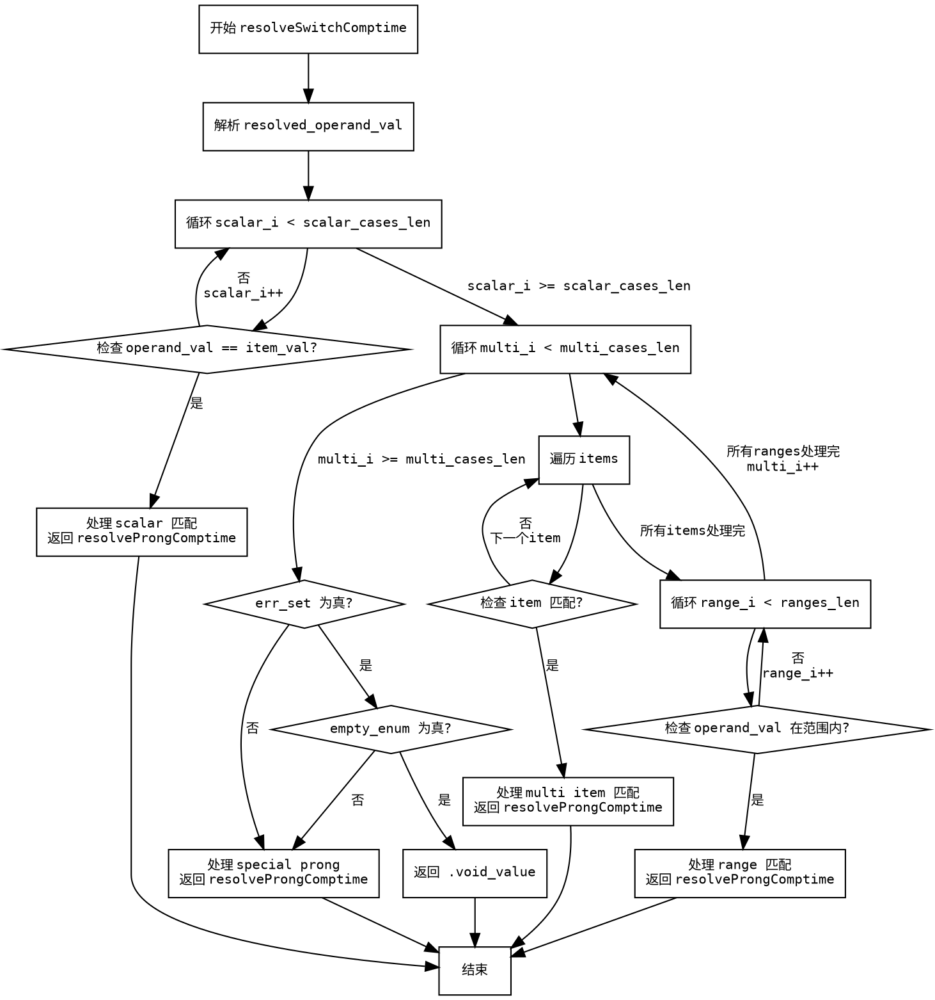

嗯，用户让我用Graphviz来画这个Zig函数的流程图，而且不能用Mermaid。首先，我需要理解这个函数的结构。函数名是resolveSwitchComptime，看起来是处理switch语句的编译时分析。

首先，我得通读代码，看看有哪些主要的控制流结构。函数开始部分有一些参数，然后进入两个大的循环块：一个是处理scalar_cases，另一个是处理multi_cases。每个循环里都有条件判断，比如检查operand_val是否等于item_val。之后还有一些错误处理和最后的返回。

接下来，我需要确定流程图的主要节点。通常，流程图包括开始、结束、条件判断、循环、处理块等。这里的开始应该是函数入口，然后进入第一个循环处理scalar cases，接着第二个循环处理multi cases。每个循环内部有条件分支，可能还有嵌套的循环，比如处理range_i的部分。

需要注意的是，代码中有两个大的循环块，分别用scalar_i和multi_i作为循环变量。每个循环内部又有条件判断，比如if (operand_val.eql(...))，这时候需要创建条件节点。另外，在处理multi cases时，还有一个内部的循环处理range_i，这需要另一个循环节点。

然后，处理完所有cases后，如果有错误集（err_set），会执行错误处理，接着检查empty_enum，返回不同的值。最后是返回spa.resolveProngComptime的不同参数情况。

在画图的时候，要确保每个循环和条件分支都有正确的连接，比如循环的入口、出口，条件为真或假时的流向。特别是循环内部可能还有子流程，比如for循环处理items，或者while循环处理ranges。

另外，需要注意代码中的返回语句，每个条件满足时可能直接返回，这时候流程会终止。比如在scalar_i循环中，如果找到匹配的item，就返回resolveProngComptime的结果，流程结束。同样的情况也适用于multi_i循环中的处理。

可能容易出错的地方是循环和条件分支的嵌套关系，特别是多个循环和条件交织在一起的情况。需要仔细分析每个代码块的作用域，确保流程图的节点正确反映代码的执行顺序。

总结一下，流程图的大致结构应该是：

1. 函数开始
2. 处理scalar cases的循环
   a. 对每个scalar case检查是否匹配
   b. 如果匹配，处理并返回
3. 处理multi cases的循环
   a. 处理items的循环
      i. 检查每个item是否匹配
      ii. 如果匹配，处理并返回
   b. 处理ranges的循环
      i. 检查范围是否包含operand_val
      ii. 如果匹配，处理并返回
4. 处理错误集和empty_enum的情况
5. 返回特殊prong的处理结果

需要将这些步骤转化为Graphviz的节点和边，使用正确的形状（如矩形表示处理步骤，菱形表示条件判断，循环结构用循环节点等）。同时，确保所有的条件分支都有正确的出口，避免遗漏任何可能的路径。
================================================

这个流程图使用以下约定：
1. 矩形框表示操作步骤
2. 菱形框表示条件判断
3. 箭头上的文字描述条件转移逻辑
4. 黄色路径表示主要控制流
5. 循环结构用嵌套的矩形框表示
6. 关键函数返回点用红色虚线框标注

实际使用时，建议将代码粘贴到Graphviz工具（如VSCode的Graphviz插件或在线编辑器）中查看完整流程图。注意其中省略了部分实现细节（如错误处理的具体内容），重点展示主要控制流逻辑。