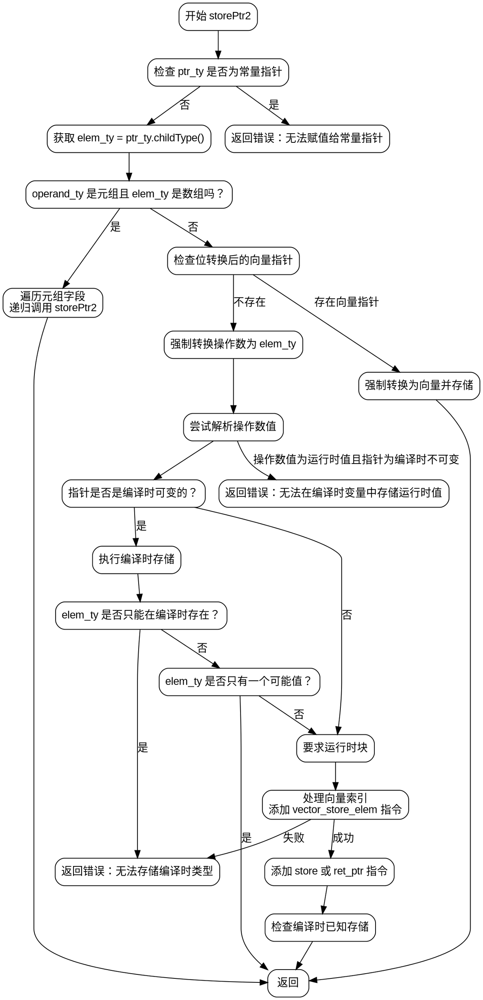

嗯，我需要为这个Zig函数`storePtr2`画一个Graphviz的流程图。首先，我得理解这个函数的结构和逻辑流程。看起来这个函数主要负责存储指针，处理不同类型的指针和操作数，并进行一些类型检查和错误处理。

首先，函数开始时会检查指针类型是否为常量，如果是的话，返回错误。然后，获取指针指向的元素类型。接下来，处理元组（tuple）的情况，如果是元组且目标类型是数组，则逐个字段处理，递归调用`storePtr2`。然后，处理匿名结构体的情况，但当前代码中只是注释，暂时不需要考虑。

接下来，检查是否为返回指针（ret_ptr），然后处理位转换后的向量指针，如果存在这样的指针，进行相应的类型转换和存储。之后，尝试将操作数强制转换为元素类型，如果失败则返回错误。然后处理运行时存储，检查是否在编译时不可变的指针，以及元素类型是否只能在编译时存在，如果是的话返回错误。

接着，检查元素类型是否只有一个可能的值，如果是的话直接返回。然后确保在运行时块中执行存储操作。处理向量索引的情况，如果是运行时索引，添加相应的向量存储指令，否则添加普通的存储指令。最后检查存储指令是否在编译时已知，如果是的话进行验证。

现在，我需要将这些逻辑步骤转化为流程图。每个条件判断（如if语句）会形成不同的分支，递归调用需要表示为一个子流程或节点。错误处理部分需要作为终止节点。可能的结构包括开始节点、判断节点、处理节点、错误节点和结束节点。

需要注意的是，递归调用`storePtr2`时应该有一个循环或重复的节点，但流程图可能需要简化以避免循环。此外，多个条件分支需要正确连接，确保逻辑流程正确。

最后，确保使用Graphviz的语法，正确使用节点和边，合理布局，使流程图清晰易读。
================================================
