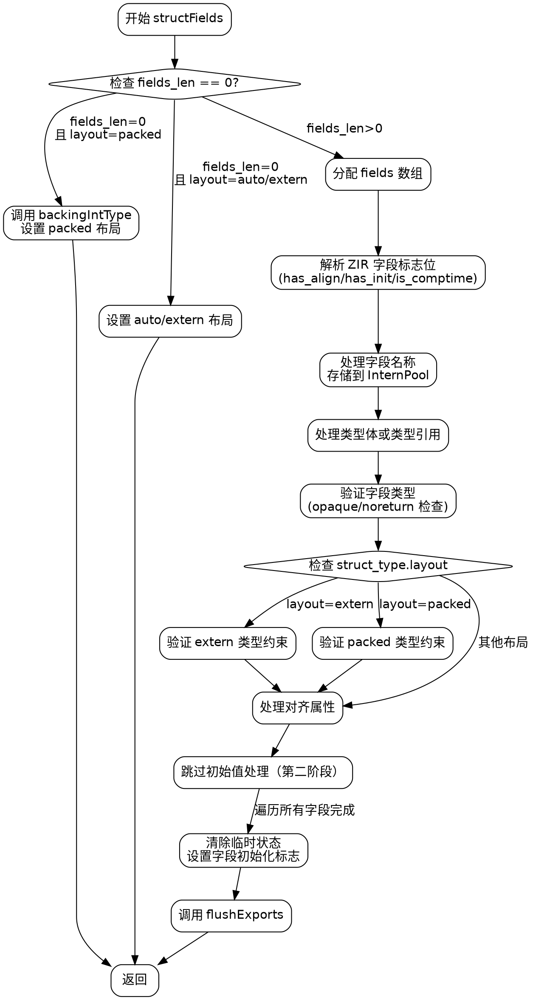

好的，我需要帮用户生成一个函数structFields的流程图，使用Graphviz。首先，我得仔细阅读这个Zig代码，理解它的逻辑结构。

首先，函数structFields处理结构体的字段，包括类型、对齐和初始化。看起来流程大致分为几个步骤：初始化变量和检查字段长度、处理不同布局的结构体、分配字段信息、解析字段的各个属性（类型、对齐、初始值）、进行类型验证，最后处理初始化和导出。

接下来，我需要把每个主要步骤转化为流程图中的节点。要注意条件分支，比如字段长度是否为0，不同的struct_type.layout情况（packed, auto, extern）。还有循环处理每个字段的部分，这里可能需要用子流程或者循环结构表示。

然后，处理每个字段时的各种情况，比如是否有对齐、初始化、是否是comptime等，这些都需要条件判断节点。解析类型、对齐和初始值的步骤需要按顺序排列，特别是类型解析可能涉及内联体解析，需要单独的处理步骤。

还要注意错误处理部分，比如当类型是opaque或noreturn时，会生成错误消息并返回。这些错误路径应该在流程图中体现出来，可能用不同的箭头表示。

在生成Graphviz代码时，要确保节点之间的连接正确，条件分支使用菱形节点，处理步骤用矩形节点。可能需要将循环部分简化为一个过程节点，或者展开表示几个关键步骤，避免过于复杂。

最后，检查是否有遗漏的步骤或条件，确保流程图准确反映代码的执行流程。可能需要多次迭代调整节点和连接，确保逻辑正确且易于理解。
================================================
