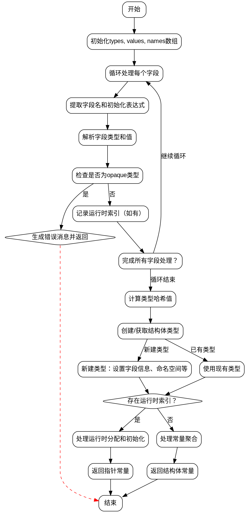

好的，我现在需要为给定的Zig函数structInitAnon绘制流程图。首先，我需要理解这个函数的结构和逻辑流程。

首先，我会通读代码，了解函数的主要步骤。函数structInitAnon似乎是用来初始化匿名结构体的。它处理两种不同的初始化类型（anon_init和typed_init），收集字段的类型、值和名称，然后根据这些信息创建或获取结构体类型，最后生成相应的常量或运行时分配的结构体实例。

接下来，我需要分解函数的各个部分：

1. **参数和变量初始化**：函数接收多个参数，包括sema、block、src等。然后初始化一些变量，如types、values、names数组，用于存储字段的类型、值和名称。

2. **处理每个字段**：通过循环遍历每个字段，从ZIR指令中提取字段名、初始化表达式等信息。对于每个字段，解析其类型和值，检查是否是opaque类型，如果是则报错。同时记录是否存在运行时值。

3. **计算类型哈希**：使用哈希函数将types、values、names的内容合并生成一个哈希值，用于后续结构体类型的唯一标识。

4. **创建或获取结构体类型**：根据哈希值，尝试在InternPool中获取现有的结构体类型，或者创建一个新的。如果是新创建的类型，需要设置其字段名称、类型、初始值等，并关联命名空间。

5. **处理运行时初始化**：如果存在需要在运行时初始化的字段（即runtime_index不为空），则生成相应的分配和存储指令。否则，直接返回结构体的常量值。

6. **返回结果**：根据是否有运行时初始化需求，返回常量引用或运行时分配的结构体实例。

接下来，我需要将这些步骤转化为流程图。流程图应该包括开始、结束节点，判断节点（如是否存在运行时初始化字段），以及各个处理步骤的流程线。

需要注意的是，流程图中需要处理不同的分支情况，例如在typed_init和anon_init两种类型下的不同处理，以及是否存在运行时索引时的不同处理路径。

可能的流程节点：

- 开始
- 初始化变量（types, values, names）
- 循环处理每个字段
  - 提取字段名和初始化表达式
  - 解析类型和值
  - 检查是否为opaque类型（报错分支）
  - 记录是否需运行时初始化
- 计算类型哈希
- 创建或获取结构体类型
  - 新类型时设置字段信息，命名空间等
- 判断是否存在运行时索引
  - 是：处理运行时分配和初始化
  - 否：返回常量
- 结束

在绘制过程中，需要特别注意条件判断的分支，如opt_runtime_index是否为null，以及不同的kind（anon_init vs typed_init）导致的处理差异。

此外，错误处理部分（如遇到opaque类型时生成错误消息并返回）也需要在流程图中体现，作为错误退出的分支。

最后，确保流程图的逻辑正确，覆盖所有主要路径和可能的条件分支，不遗漏关键步骤。
================================================
