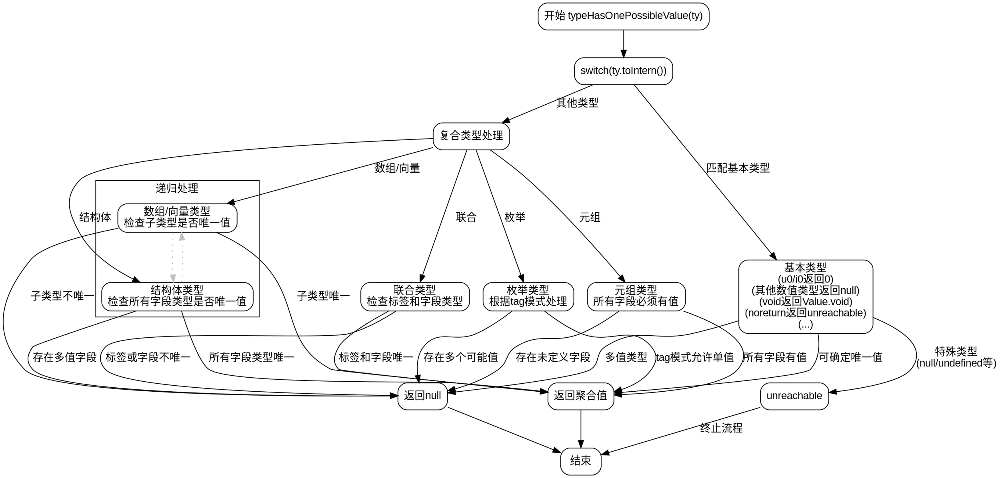

嗯，用户让我用Graphviz画一个Zig函数的流程图。首先，我需要仔细理解这个函数的逻辑结构。这个函数叫做typeHasOnePossibleValue，看起来是用来判断某个类型是否只有一个可能的值，如果是的话返回那个值，否则返回null或者其他错误。

首先，函数开始于pub fn typeHasOnePossibleValue，然后进入一个switch语句，根据ty.toIntern()的不同情况进行处理。每个case可能有不同的返回值，比如对于u0_type和i0_type返回0，对于其他基本类型返回null，void_type返回Value.void，等等。

接下来，在处理复杂类型时，比如数组、结构体、元组、联合体和枚举，函数会递归检查它们的子类型是否也只有一个可能的值。例如，对于数组类型，会检查子类型是否有唯一值；对于结构体，会检查所有字段的类型是否都有唯一值；对于联合体，需要检查标签类型和字段类型是否有唯一值；对于枚举类型，根据不同的标签模式进行处理。

我需要把这些逻辑分支用Graphviz的节点和边表示出来。每个主要的switch case应该对应一个节点，递归调用的情况可能需要子流程或者单独的节点。注意处理可能的错误和特殊情况，比如unreachable的情况。

另外，函数中有很多条件判断和递归调用，需要确保流程图的层次清晰，避免交叉线太多。可能需要使用子图来分组不同类型的处理逻辑，比如基本类型、复合类型等。

需要注意的是，用户特别强调不要用Mermaid，必须用Graphviz。因此，我需要严格按照Graphviz的语法来编写，使用digraph，定义各个节点，并用箭头连接它们表示流程走向。同时，合理使用条件判断的分支，比如if-else结构，在Graphviz中用不同的节点和边来表示。

可能遇到的难点是如何处理递归调用和复杂的嵌套switch结构。这可能需要将递归部分单独作为一个子流程，或者用注释节点来简化表示，保持流程图的可读性。

最后，检查流程图是否覆盖了所有可能的case，特别是那些返回null、Value或者触发unreachable的情况，确保没有遗漏重要的逻辑分支。
================================================
