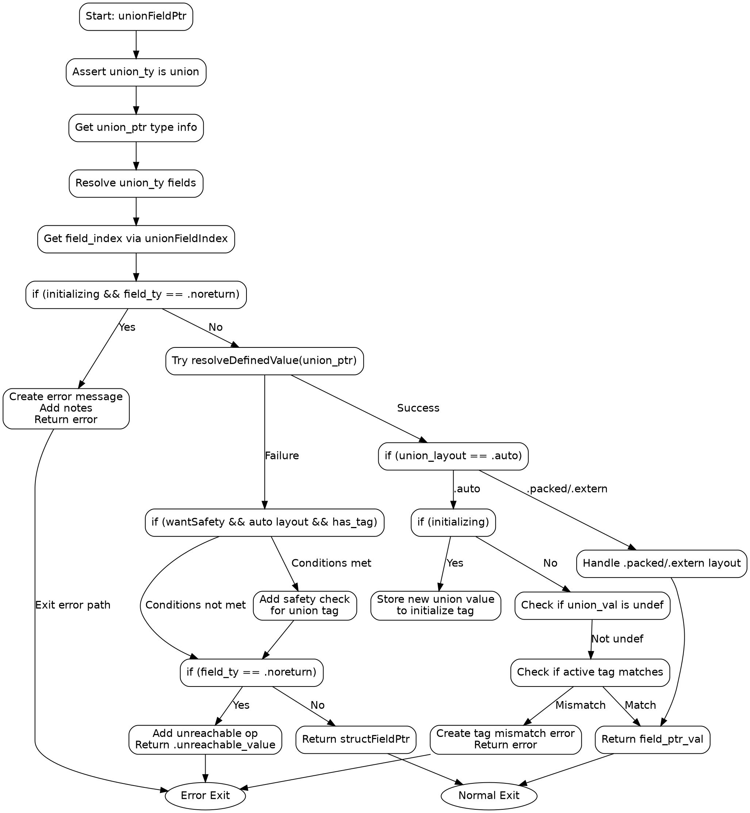

好的，我现在需要为提供的Zig函数`unionFieldPtr`绘制一个流程图。首先，我需要仔细理解这个函数的结构和逻辑流程，然后将其分解为不同的步骤和条件分支，最后用Graphviz的DOT语言表示出来。

首先，我会通读整个函数代码，了解其主要功能和逻辑分支。函数`unionFieldPtr`的主要作用似乎是处理联合体（union）的字段指针，包括类型检查、安全性验证、错误处理等。

函数开始部分进行了一些断言和初始化操作，例如确认`union_ty`的类型是联合体，获取`union_ptr`的类型信息，解析联合体的字段，获取字段索引等。接着，根据不同的条件（如`initializing`标志、联合体的布局类型、安全性检查等）进行不同的处理逻辑。

接下来，我需要识别函数中的主要分支和循环结构。例如：

1. 检查`initializing`是否为真，并且字段类型是否为`noreturn`，如果是，则生成错误消息。
2. 处理联合体不同的布局（auto、packed、extern）时的不同逻辑。
3. 在非初始化情况下，检查联合体的标签是否匹配当前字段，否则报错。
4. 安全性检查，确保访问的字段是当前激活的字段。
5. 处理字段类型为`noreturn`的情况，生成`unreachable`指令。
6. 最后返回字段指针。

我需要将这些步骤转化为流程图中的节点，并用条件判断连接它们。需要注意的是，有些条件可能嵌套，需要正确表示层次结构。

例如，函数开始时的初始化步骤可以作为一个顺序节点，然后是条件判断`if (initializing && field_ty is noreturn)`，如果是，则进入错误处理流程；否则继续。接下来处理`initializing`为真时的不同情况，如联合体布局为auto时的初始化操作。之后，处理非初始化情况下的标签匹配检查。然后进行安全性检查，最后处理字段类型并返回结果。

在绘制流程图时，需要注意各个条件分支的起始和结束点，确保逻辑的正确性和流程的连贯性。同时，需要处理可能的错误路径，如生成错误消息并返回错误。

此外，需要处理一些复杂的嵌套条件，例如在`if (try sema.resolveDefinedValue(...)) |union_ptr_val| ct: { ... }`中，内部有多个条件分支，需要正确展开这些嵌套结构。

最后，使用Graphviz的DOT语法将各个节点和边连接起来，形成完整的流程图。确保节点标签清晰，条件判断明确，流程易于理解。
================================================
