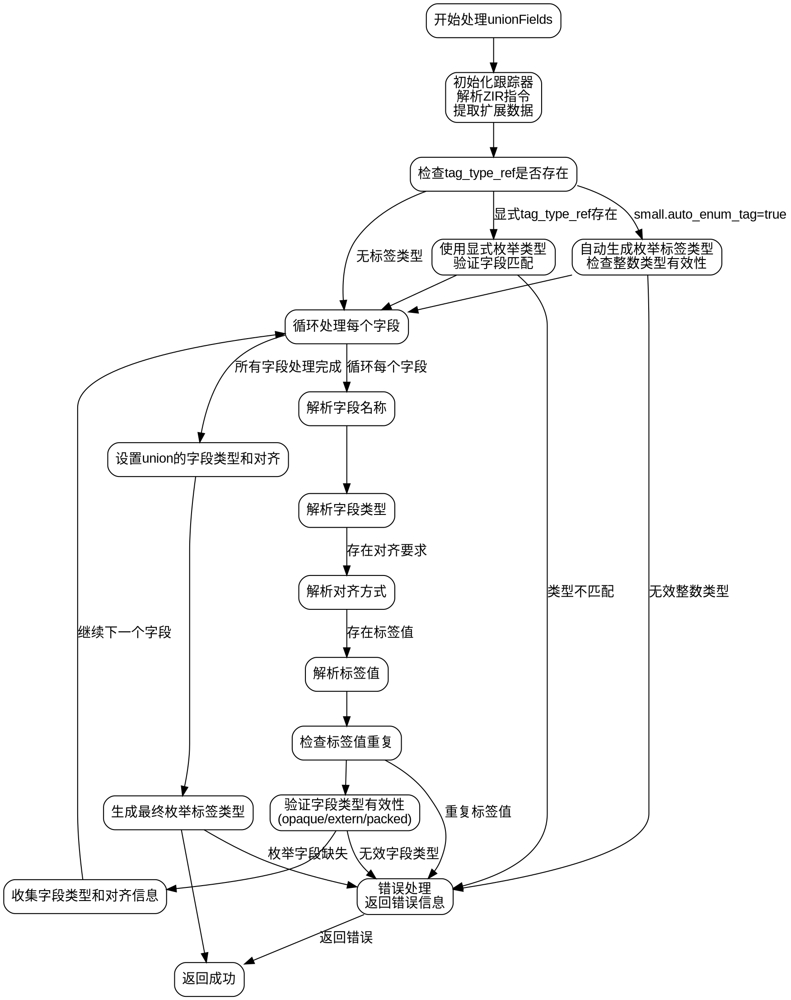

嗯，我需要为这个Zig函数`unionFields`画一个流程图。首先，我得仔细阅读代码，理解每个步骤的作用。函数的主要任务是处理联合类型的字段，包括类型检查、标签生成、字段对齐等。

首先，函数开始时会进行一些初始化操作，比如获取跟踪器、解析ZIR指令等。然后根据不同的条件处理标签类型，比如是否有自动枚举标签，或者是否提供了显式的枚举类型。接着处理字段的类型、对齐方式以及标签值。需要处理各种错误情况，比如类型不匹配、重复的标签值等。最后设置字段类型和对齐，并生成最终的枚举标签类型。

在画流程图时，应该从函数入口开始，按照逻辑分支逐步展开。比如，处理`tag_type_ref`的条件分支，处理字段的不同属性（类型、对齐、标签），错误处理的分支，以及最终的设置和生成标签类型。

需要注意的是，代码中有多个条件判断，比如`small.has_tag_type`、`small.auto_enum_tag`等，这些都需要在流程图中体现为不同的分支。同时，错误处理部分如返回错误信息，也需要在流程图中明确标出。

此外，代码中涉及到循环处理每个字段，这可能需要一个循环结构来表示。对于每个字段，处理其名称、类型、对齐和标签，这些步骤应该在循环体内详细展示。

最后，生成枚举标签类型的部分也需要在流程图中体现，根据是否有显式标签或自动生成的情况，分为不同的路径。

总结一下，流程图的结构大致如下：
1. 函数入口和初始化
2. 处理标签类型（显式或自动生成）
3. 处理字段循环：
   a. 处理每个字段的名称、类型、对齐、标签
   b. 错误检查（如类型无效、重复标签等）
4. 设置字段类型和对齐
5. 生成最终的枚举标签类型
6. 错误处理和返回

需要确保每个条件分支和循环都正确表示，并且各步骤之间的逻辑关系清晰。
================================================
