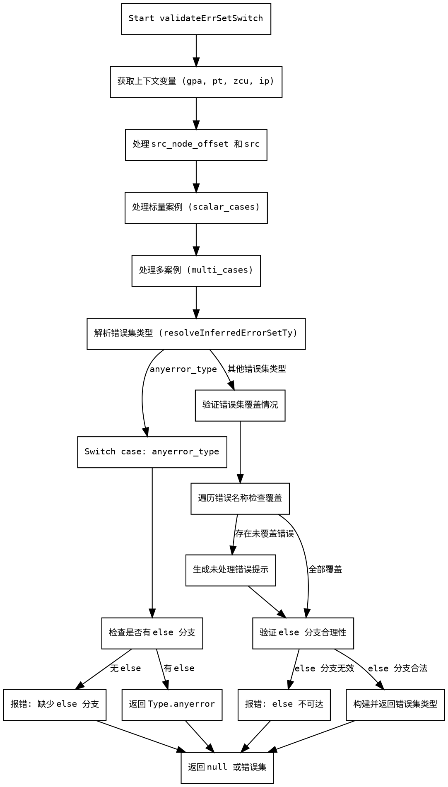

嗯，我需要为这个Zig函数`validateErrSetSwitch`画一个流程图。首先，我得先理解这个函数的结构和逻辑流程。让我仔细读一下代码。

函数一开始声明了一些参数，比如`sema`、`block`、`seen_errors`等。然后，它获取了一些上下文变量，比如`gpa`、`pt`、`zcu`和`ip`。接着处理`src_node_offset`和`src`。

接下来，函数分为两个主要部分：处理标量案例（scalar cases）和处理多案例（multi cases）。每个标量案例都会调用`validateSwitchItemError`，并将结果添加到`case_vals`中。类似地，多案例部分会遍历每个项目，同样调用`validateSwitchItemError`，并确保没有范围（range）的情况。

之后，函数进入一个`switch`语句，根据解析的`err_set_ty_index`进行处理。如果是`anyerror_type`，则检查是否有`else`分支，没有的话报错。否则，处理错误集合中的每个错误名称，检查是否所有错误都被处理，如果有遗漏，生成错误消息。

如果有`else`分支但所有错误已经被处理，则检查`else`分支的内容是否合理，比如是否包含不可达的代码，如果是的话报错。最后，构建并返回错误集合类型。

我需要将这些步骤转化为流程图。流程图的开始应该是函数入口，然后分支处理标量和多案例，之后进入switch判断。根据不同的情况，处理错误集合，检查else分支，最后返回结果或报错。

需要注意的是条件判断和循环结构，比如处理标量案例时的`while`循环，处理多案例时的循环，以及遍历错误名称的循环。这些在流程图中应该用判断框和循环框表示。

可能遇到的困难是正确表达循环和条件分支的嵌套关系，以及确保每个步骤的逻辑顺序正确。需要仔细检查每个代码块的作用，并确定它们在流程图中的位置。
================================================
