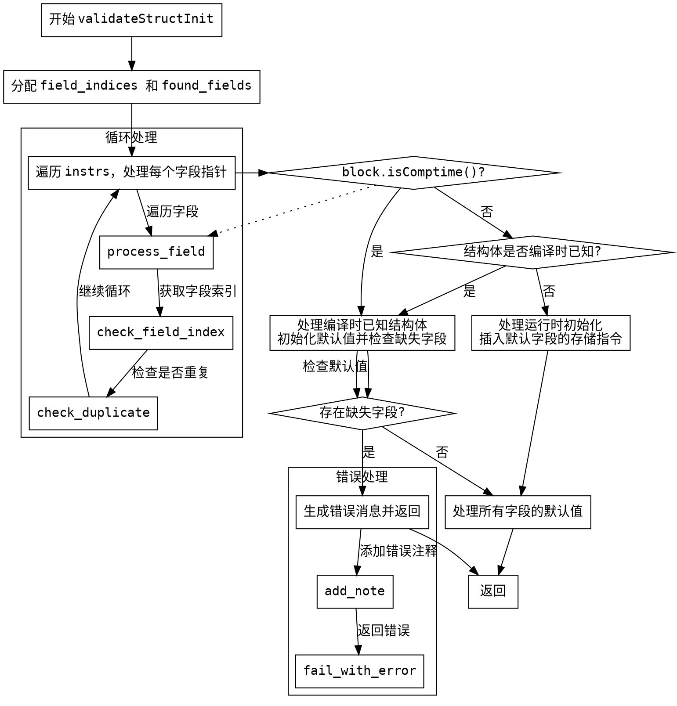

好的，我现在需要为给定的Zig函数`validateStructInit`生成一个Graphviz的流程图。首先，我需要理解这个函数的主要逻辑，然后将其分解为不同的步骤和决策点，最后将这些步骤转化为流程图中的节点和边。

首先，我会通读整个函数，了解它的结构和主要功能。这个函数的主要目的是验证结构体的初始化，处理字段的默认值、错误检查以及编译时和运行时的不同情况。函数涉及内存管理、错误处理、字段索引的分配和释放，以及结构体字段的初始化和存储。

接下来，我需要识别函数中的关键步骤和条件判断。例如：

1. 分配和释放内存`field_indices`和`found_fields`。
2. 遍历`instrs`，处理每个字段指针，确定字段名称和索引。
3. 检查是否在编译时已知结构体指针，并处理默认值。
4. 处理缺失的字段，生成错误消息。
5. 处理运行时和编译时的不同情况，插入相应的存储指令。
6. 处理结构体是否为元组类型，调用不同的方法获取字段指针。
7. 错误处理部分，收集错误消息并在必要时终止函数。

然后，我需要将这些步骤转化为流程图中的节点。每个主要步骤可以作为一个节点，条件判断（如`if`语句）作为决策节点，分支不同的流程。例如：

- 开始节点：函数入口。
- 分配内存`field_indices`和`found_fields`。
- 遍历`instrs`的循环。
- 检查`block.isComptime()`是否为真。
- 处理缺失字段的错误。
- 检查结构体是否在编译时已知。
- 处理编译时和运行时的存储指令。
- 错误处理路径。
- 结束节点：函数返回。

在绘制边时，需要注意条件判断后的分支方向，比如“是”或“否”分别指向哪个节点。例如，如果`block.isComptime()`为真，则处理默认值的存储；否则，继续处理其他情况。

需要注意的一些细节：

- 函数中有多个错误检查点，需要将这些错误处理路径正确连接。
- 内存的分配和释放（如`defer gpa.free`）可能需要在流程图中体现，但可能作为步骤的一部分。
- 循环结构（如`for`循环遍历`instrs`）需要表示为循环节点。
- 函数最后的处理分为编译时和运行时两种情况，需要分别处理。

可能出现的问题包括：

1. 复杂条件判断可能导致流程图分支过多，需要合理合并或简化。
2. 错误处理路径需要正确连接到生成错误消息并返回的节点。
3. 确保循环结构正确表示，包括循环内的处理步骤。
4. 确保所有可能的执行路径都被覆盖，特别是错误路径和正常路径。

现在，我需要将这些分析转化为Graphviz的dot格式，定义节点和边，使用合适的形状（如矩形表示步骤，菱形表示条件判断），并确保逻辑正确，流程清晰。
================================================
