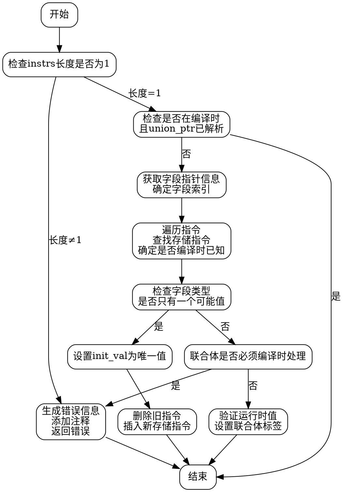

嗯，我现在需要为这个Zig函数`validateUnionInit`画一个流程图。首先，我得仔细看一下这个函数的代码，理解它的逻辑结构。看起来这个函数是用来验证联合体的初始化是否正确，处理一些编译时的逻辑，可能涉及到错误检查、类型判断等步骤。

首先，函数开始时会检查`instrs`的长度是否为1，如果不是，就会生成错误信息，指出联合体不能同时初始化多个字段。这里有一个条件判断，如果长度不等于1，就会进入错误处理流程，包括创建错误消息、添加注释等，最后返回错误。这应该对应流程图中的一个判断分支。

接下来，如果当前块是在编译时（`block.isComptime()`），并且已经解析了`union_ptr`的值，就直接返回，不需要进一步处理。这也是一个条件判断，可能需要一个分支。

然后，函数获取第一个字段指针的信息，检查字段名称，确定字段索引。这里可能会有错误处理，比如如果字段不存在，可能抛出错误。这部分可能涉及多个步骤，比如获取字段名称、查找字段索引等。

接着，函数尝试确定联合体是否是编译时已知的。它通过遍历当前块的指令，查找存储指令（store），并分析这些指令的操作数，判断是否指向当前字段指针。这部分逻辑比较复杂，可能涉及循环遍历指令，检查每个指令的类型和操作数，以确定初始化的值是否是编译时已知的。

之后，处理字段类型只有一个可能值的情况，直接使用该值。然后根据是否有初始值`init_val`，分为两种情况：如果有，就删除原有的字段指针和存储指令，插入新的存储指令；如果没有，并且联合体只能在编译时处理，就返回错误。否则，验证运行时值，并设置联合体的标签。

整个流程涉及到多个条件判断、循环处理指令，以及不同的错误处理路径。需要将这些步骤分解成流程图中的各个节点，并用箭头表示控制流的方向。

可能的结构是：

1. 开始
2. 检查instrs长度是否为1 → 不是 → 生成错误信息，返回错误
3. 是 → 检查是否在编译时且已解析union_ptr → 是 → 直接返回
4. 否 → 获取字段指针信息，确定字段索引
5. 遍历指令，查找存储指令，确定是否是编译时已知
6. 检查字段类型是否只有一个可能值 → 是 → 设置init_val为该值
7. 如果有init_val → 删除原有指令，插入新存储指令
8. 否则 → 检查是否必须编译时 → 是 → 返回错误
9. 否则 → 验证运行时值，设置标签
10. 结束

需要注意的是循环遍历指令的部分可能需要一个循环结构，但流程图可能需要简化这部分为判断步骤。另外，错误处理的不同分支需要正确连接。

需要确保每个条件判断都有对应的分支，每个处理步骤都有对应的节点，并且流程正确连接。可能还需要处理多个错误路径，比如在生成错误信息时的多个错误注释添加步骤，但这些可能在流程图中简化为一个错误处理节点。

最后，使用Graphviz的DOT语言来绘制这个流程图，正确使用节点和边来表示各个步骤和判断。
================================================

该流程图使用Graphviz描述函数逻辑，主要步骤如下：

1. **入口**：函数开始执行
2. **长度校验**：检查初始化指令数量是否为1，非法则进入错误处理
3. **编译时检查**：若处于编译时且指针已解析，直接退出
4. **字段解析**：获取字段元数据并验证字段有效性
5. **指令遍历**：逆向扫描AIR指令，分析存储操作是否编译时已知
6. **单值类型处理**：若字段类型只有一种可能值，直接使用该值
7. **编译时初始化**：清理旧指令并用编译时值初始化联合体
8. **编译时约束检查**：若联合体必须编译时初始化但无法确定值，报错
9. **运行时处理**：非编译时场景下验证值并设置联合体标签
10. **出口**：函数结束

错误路径统一收敛到错误处理节点，关键决策点用菱形分支表示。实际实现中循环遍历指令的部分被简化为单节点以提高可读性。