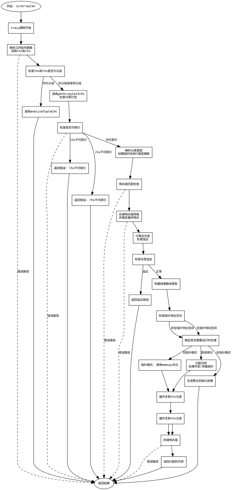

好的，我现在需要为给定的Zig函数`zirArrayCat`绘制一个流程图。首先，我需要理解这个函数的结构和逻辑流程，这样才能准确地将其转化为图形表示。

首先，我会通读整个函数，了解其主要功能和各个部分的作用。这个函数看起来是用来处理数组连接操作的，可能涉及类型检查、错误处理、内存分配等步骤。函数名`zirArrayCat`中的“zir”可能指的是Zig Intermediate Representation，所以这个函数可能是在编译器的一个中间表示阶段处理数组连接的操作。

接下来，我会尝试分解函数的各个步骤：

1. **初始化和跟踪**：函数开始使用`tracy`进行跟踪，这可能用于性能分析或调试。
2. **获取指针和上下文**：从参数`sema`中获取`pt`、`zcu`等上下文信息。
3. **解析指令数据**：从ZIR指令中提取操作数（`lhs`和`rhs`）及其类型。
4. **类型检查**：检查左右操作数是否为元组（tuple），如果是，调用`analyzeTupleCat`处理。
5. **获取数组信息**：通过`getArrayCatInfo`检查左右操作数是否为可索引类型，否则返回错误。
6. **解析元素类型**：通过创建临时块和类型解析，确定最终的元素类型。
7. **处理哨兵值（sentinel）**：检查左右操作数的哨兵值是否匹配，处理可能的类型转换。
8. **计算结果长度**：将左右操作数的长度相加，处理溢出情况。
9. **构建结果类型**：根据元素类型、长度和哨兵值创建数组类型。
10. **处理指针地址空间**：确定结果的指针地址空间。
11. **运行时处理**：根据操作数的类型（数组、结构体、指针等），进行相应的内存分配和元素复制。
12. **生成结果**：构建最终的数组或指针，并返回。

接下来，我需要将这些步骤转化为流程图。流程图通常包括开始、结束、处理步骤、条件判断、循环等元素。由于函数中存在多个条件分支（如是否为元组、是否具有哨兵值、是否是指针等），这些需要表示为菱形判断节点。

需要注意的是，代码中存在多个错误处理路径，例如当数组长度相加溢出时，会返回错误。这些错误处理需要在流程图中体现出来。

此外，函数中有一些循环结构，例如在处理数组元素时，使用`while`循环逐个处理左右操作数的元素，这些循环需要在流程图中用循环节点表示。

可能遇到的挑战包括：
- 处理复杂的条件分支，尤其是嵌套的条件。
- 准确表示错误处理的路径。
- 确保循环和并行列的正确表示。

我需要仔细检查每个条件分支，确保每个可能的路径都有对应的节点和箭头。同时，注意代码中的返回语句，每个返回点都对应流程图的结束节点。

最后，生成Graphviz的DOT语言代码，使用适当的节点和边来表示整个流程。确保节点标签清晰，逻辑正确，结构合理。
================================================
