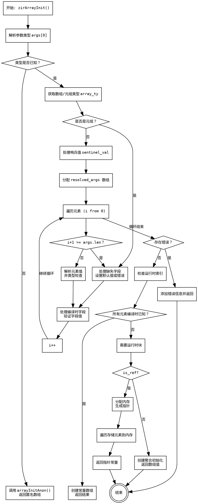

嗯，我需要为这个Zig函数`zirArrayInit`绘制一个流程图。首先，我得仔细阅读代码，理解它的结构和逻辑流程。看起来这个函数处理数组的初始化，可能包括元组（结构体）和普通数组的情况。函数中有很多条件判断，比如检查参数数量、处理编译时已知的值、处理运行时索引，还有错误处理的部分。

首先，我需要确定函数的主要步骤。从代码来看，函数开始于解析类型参数，然后处理元素初始化。接着检查是否有缺失的元组字段，处理默认值或哨兵值。之后，会处理编译时已知的值，生成常量；如果有运行时索引，则分配内存并存储元素。最后，根据是否是引用返回不同的结果。

接下来，我需要将这些步骤分解成流程图中的各个节点。可能的节点包括：解析参数、检查参数数量、处理匿名数组初始化、解析数组类型、检查元组类型、处理默认值和哨兵值、处理每个元素、检查编译时已知、处理运行时索引、分配内存、存储元素到内存、生成常量或返回结果等。

需要注意的是错误处理部分，比如`root_msg`的创建和销毁，还有`errdefer`的使用，这些可能在流程图中需要表示错误路径。另外，条件分支如参数数量是否足够、是否是元组、是否所有参数都是编译时已知等，都需要在流程图中体现。

还要考虑循环结构，比如遍历`resolved_args`数组，处理每个元素。这里可能需要一个循环节点，表示对每个元素进行类型检查和赋值。

在绘制流程图时，应该用矩形框表示操作步骤，菱形框表示条件判断，箭头表示流程方向。同时，需要确保各个分支正确连接，例如处理匿名数组的情况直接返回，而其他情况继续后续处理。

可能还需要注意一些细节，比如`is_ref`参数的影响，在最后部分决定是返回分配的内存指针还是数组值。这部分也是一个条件分支。

最后，确保流程图清晰展示函数的整体逻辑，包括错误路径和各个条件分支的处理，这样读者可以一目了然地理解函数的执行流程。
================================================
