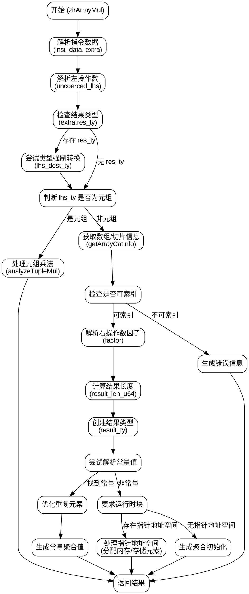

好的，我需要为提供的Zig函数`zirArrayMul`绘制一个流程图。首先，我需要理解这个函数的结构和逻辑流程。

函数开始部分定义了一些变量，比如`tracy`用于跟踪，然后解引用了一些指令数据。接着处理左右操作数（lhs和rhs），并进行类型检查和转换。如果类型是元组（tuple），会处理元组的乘法；否则，检查是否是可索引的类型。之后处理数组或向量的乘法，计算新的长度，生成结果类型，处理常量值优化，最后生成相应的IR指令。

我需要将这些步骤分解成不同的节点，并按照执行顺序连接起来。需要注意条件分支，比如类型是否为元组，是否有指针地址空间等。此外，错误处理部分也需要体现在流程图中，比如`resolveInt`失败时的错误返回。

可能的节点包括：
1. 开始（函数入口）
2. 解析指令数据
3. 处理左操作数（lhs）的类型检查和转换
4. 判断是否为元组类型
5. 处理元组乘法
6. 检查是否为可索引类型
7. 解析右操作数（rhs）的因子
8. 计算结果长度
9. 生成结果类型
10. 处理常量值优化
11. 生成运行时指令（如分配内存、存储元素等）
12. 返回结果

需要将这些节点按照逻辑连接，注意条件分支和循环结构。例如，如果类型是元组，则进入元组处理流程；否则继续检查是否为可索引类型。在处理常量值时，如果解析成功，则生成常量结果，否则进入运行时处理部分。

还要注意错误处理路径，比如在`resolveInt`失败时，直接返回错误。这些错误路径需要用不同的箭头表示。

最后，确保流程图清晰展示函数的主要逻辑分支和步骤，避免过于复杂，同时覆盖所有重要判断和操作。
================================================
