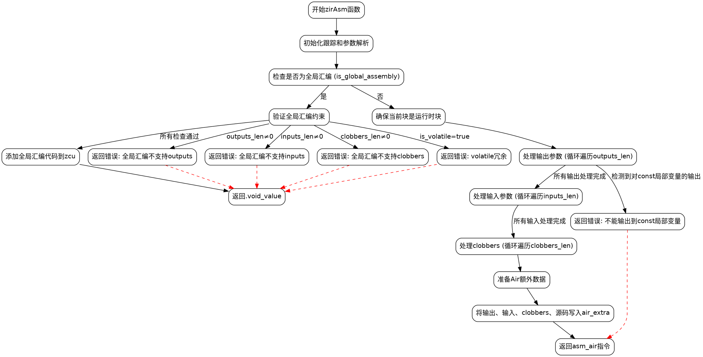

好，我现在需要为给定的Zig函数`zirAsm`绘制流程图。首先，我得仔细理解这个函数的结构和逻辑流程。这个函数看起来是处理内联汇编的，涉及到模块级汇编和普通汇编的不同情况处理，还有各种参数的处理，比如输出、输入、clobbers等。

首先，函数开始时会执行一些初始化操作，比如跟踪和延迟结束跟踪。然后解析一些参数，比如`extended.small`中的各个长度字段。接下来判断是否是全局汇编（模块级），如果是的话，检查是否有输出、输入或clobbers，如果有的话报错，否则添加全局汇编并返回。如果不是全局汇编，则进入正常处理流程。

接下来处理输出参数，这里有一个循环遍历每个输出，处理类型和操作数，检查是否有const本地变量，然后记录约束和名称。然后处理输入参数，同样循环处理每个输入，处理类型转换，记录约束和名称。之后处理clobbers，记录每个clobber的名称。

然后，准备Air的额外数据，将输出、输入、clobbers和汇编源代码写入到`air_extra`中。最后返回生成的`asm_air`指令。

接下来，我需要将这些步骤转化为流程图的结构。流程图的开始是函数入口，然后是各个判断和处理步骤。需要注意条件分支，比如是否是全局汇编，以及各个循环处理部分。每个判断可能导致不同的路径，比如模块级汇编的错误检查，或者正常流程的处理。

需要确保每个判断点都有正确的分支，比如`is_global_assembly`为真时进入模块级处理，否则进入普通处理。在处理输出、输入和clobbers时，每个循环需要表示为流程图的循环结构，可能用过程块表示循环体。

另外，错误处理的部分，比如返回错误的地方，也需要在流程图中体现出来，比如当模块级汇编有输出时，立即返回错误。每个错误条件都需要一个终止点。

最后，组装Air部分的数据，包括各个部分的写入，确保流程正确连接到最终的返回指令。

在绘制时，需要注意流程的顺序和分支的正确连接，避免遗漏步骤。可能需要将循环展开为多个步骤，或者使用子流程来表示循环处理。同时，确保每个步骤的描述准确，不会引起歧义。
================================================
