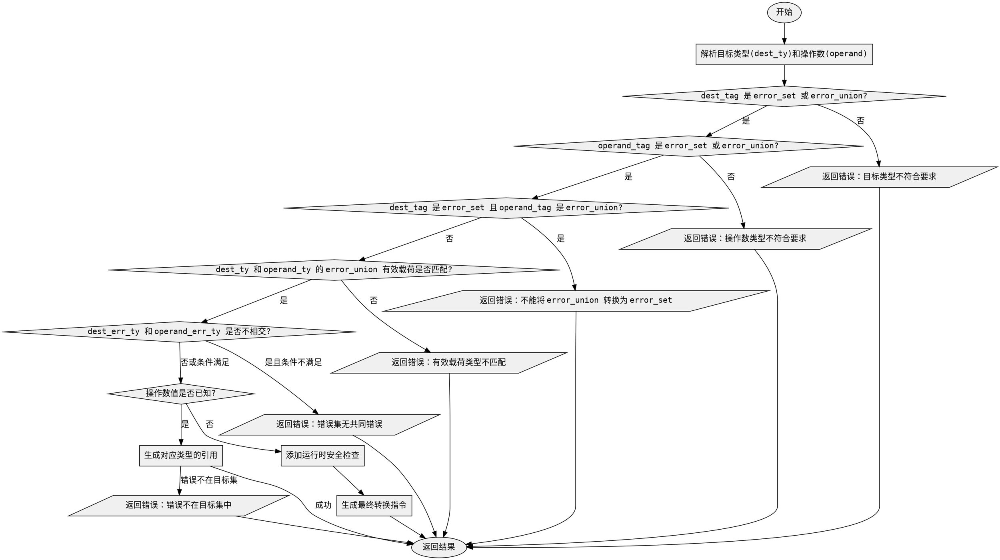

好的，我需要为给定的Zig函数`zirErrorCast`绘制一个流程图。首先，我得仔细阅读代码，理解它的逻辑结构，然后逐步分解每个判断和处理步骤，转化为流程图中的各个节点和分支。

首先，函数的主要步骤大致如下：

1. **解析目标类型和操作数类型**：检查目标类型和操作数类型是否为错误集或错误联合类型。
2. **类型检查**：
   - 如果目标类型是错误集，但操作数是错误联合类型，报错。
   - 如果两者都是错误联合类型，但有效载荷类型不匹配，报错。
3. **错误集是否不相交检查**：
   - 处理推断的错误集，确定目标错误集和操作数错误集是否有共同错误。
   - 如果没有共同错误且不满足某些条件，报错。
4. **处理已知值的情况**：
   - 如果操作数值已知，检查错误名称是否在目标错误集中，若不在则报错。
   - 根据目标类型生成相应的引用。
5. **运行时安全检查**：
   - 根据需要添加安全性检查，例如错误代码的有效性。
6. **生成最终结果**：根据不同的类型转换生成相应的指令。

接下来，我需要将这些步骤转化为流程图的节点，并用条件分支连接起来。需要注意各个条件判断的分支路径，例如类型不匹配时的错误处理，以及不同情况下的处理逻辑。

特别要注意的是，函数中有多个嵌套的条件判断，比如对`dest_tag`和`operand_tag`的各种组合进行判断。每个判断可能导致不同的处理流程或错误提示。此外，处理推断错误集的部分比较复杂，需要仔细分解。

另外，代码中有一些错误处理的情况，比如使用`sema.fail`返回错误信息，这些在流程图中应表示为终止节点或错误节点。

在绘制流程图时，应使用不同的形状表示不同的节点类型，例如：
- 开始和结束节点使用椭圆形。
- 处理步骤使用矩形。
- 条件判断使用菱形。
- 错误处理或返回使用平行四边形或其他适当形状。

需要确保流程图的逻辑清晰，每个判断的分支都有明确的路径，避免遗漏任何可能的执行路径。同时，要处理好循环和递归的部分，但在这个函数中似乎没有明显的循环结构，主要是条件分支。

最后，根据上述分析，用Graphviz的DOT语言描述整个流程图的结构，确保语法正确，节点和边连接准确。
================================================
