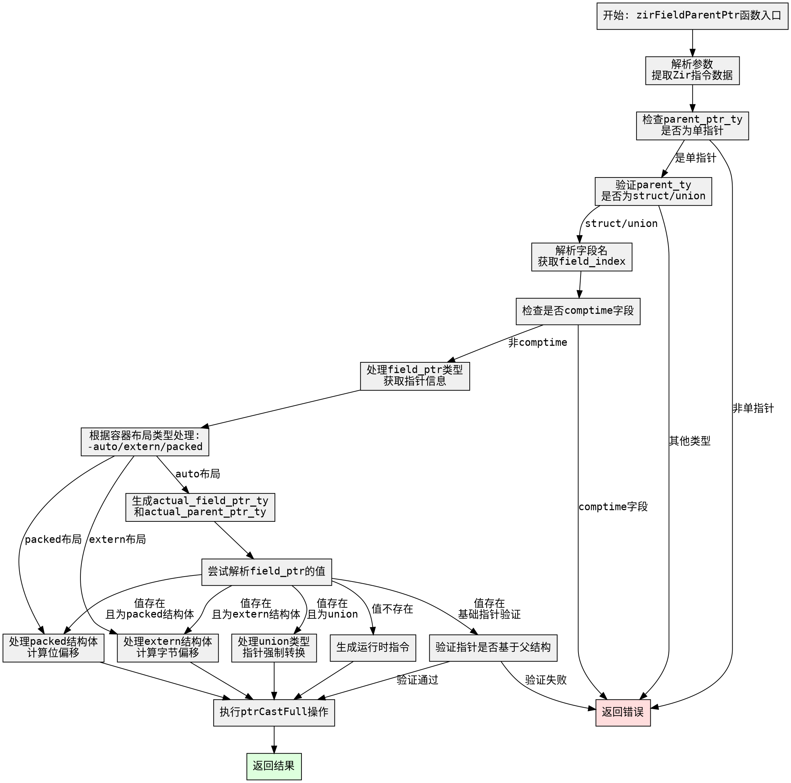

嗯，用户让我用Graphviz来画这个Zig函数的流程图。首先，我需要理解这个函数的结构和逻辑流程。这个函数名为zirFieldParentPtr，看起来是处理Sema（语义分析）中的某个指针操作，可能涉及到结构体或联合体的字段父指针。

首先，我得通读整个函数，理清各个步骤。函数开始部分处理参数，比如从Zir指令中提取数据，检查指针类型，验证是否为结构体或联合体类型。然后处理字段名，获取字段索引，检查是否为comptime字段。接着处理字段指针的类型，进行各种指针信息的比较和调整，根据不同的容器布局（auto、extern、packed）计算对齐和偏移。最后生成结果，可能进行指针转换。

接下来，我需要将这些步骤转化为流程图中的节点。每个主要操作或条件判断都是一个节点。例如：

1. 初始化参数和提取数据。
2. 检查parent_ptr_ty是否为单指针。
3. 验证parent_ty是否为结构体或联合体。
4. 解析字段名并获取field_index。
5. 检查是否为comptime字段。
6. 处理field_ptr的类型和指针信息。
7. 根据容器布局（auto、extern、packed）调整指针信息。
8. 生成actual_field_ptr_ty和actual_parent_ptr_ty。
9. 尝试解析field_ptr的值，进行不同的处理路径（如extern结构体的偏移计算、联合体的指针强制转换等）。
10. 处理成功或失败的情况，返回结果或错误。

需要注意的是条件分支，比如switch语句和错误处理。例如，当parent_ty的类型是结构体或联合体时，不同的处理路径；容器布局的不同情况；以及运行时与编译时值的处理差异。

在绘制流程图时，使用Graphviz的语法，用节点表示步骤，箭头表示流程方向。条件判断用菱形节点，不同的分支用标签标注。例如，检查指针类型是否为结构体/联合体，如果不是则返回错误。

同时，错误处理部分需要特别注意，每个可能返回错误的地方都要有对应的节点和箭头指向错误输出。比如，检查到parent_ptr_ty的size不为one时，返回错误；字段是comptime时返回错误等。

最后，确保整个流程图的连贯性，所有可能的执行路径都被覆盖，没有遗漏的分支。特别是那些嵌套的条件和循环结构，需要正确映射到Graphviz的节点和连接线上。

可能遇到的难点是处理复杂的条件分支，特别是多个嵌套的switch和if语句。需要仔细分析每个条件，确保每个分支都被正确表示。此外，确保错误处理的路径清晰，不会与其他正常流程混淆。

总结步骤：
1. 分解函数为多个步骤和条件判断。
2. 为每个步骤创建Graphviz节点。
3. 用箭头连接步骤，表示执行顺序。
4. 为条件判断添加分支标签。
5. 包含错误处理节点和路径。
6. 验证流程图的完整性和准确性。
================================================
