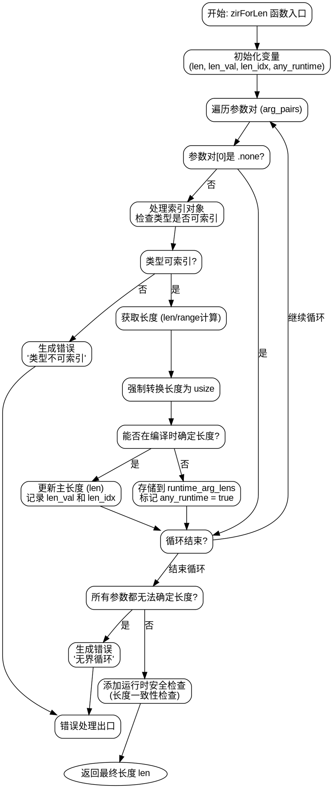

好的，我需要为给定的 Zig 函数 `zirForLen` 生成一个流程图。首先，我需要理解这个函数的结构和逻辑流程。

函数的主要步骤包括：

1. **初始化变量**：如 `len`, `len_val`, `len_idx`, `any_runtime` 等。
2. **处理参数对**：遍历 `arg_pairs`，对每个参数对进行处理。
   - 如果参数对中的第一个元素是 `.none`，跳过。
   - 处理索引对象或范围，计算长度。
   - 检查类型是否可索引，不可索引则报错。
   - 收集编译时已知的长度值或运行时长度。
3. **检查所有参数后的长度一致性**：
   - 如果所有长度在编译时已知且不一致，报错。
   - 如果存在运行时长度，记录需要运行时检查。
4. **处理无界循环情况**：如果所有参数都无法确定长度，报错。
5. **运行时安全检查**：如果需要，添加运行时长度检查。

接下来，我需要将这些步骤转化为流程图的结构。流程图应该包括：

- **开始节点**：函数入口。
- **处理每个参数对的循环**：包含条件判断（是否为 `.none`，是否为范围等）。
- **错误处理节点**：当类型不可索引或长度不一致时。
- **收集长度信息**：编译时和运行时。
- **最终检查**：无界循环检查和运行时安全检查。
- **结束节点**：返回长度 `len`。

需要注意条件分支的正确连接，特别是错误处理路径和正常流程的分离。同时，确保循环结构清晰，处理每个参数对的步骤明确。

可能遇到的挑战是如何正确表示循环内的条件分支，尤其是嵌套的条件判断。需要确保每个条件（如是否为 `.none`，是否为范围）都有对应的处理路径，并且错误情况能够正确导向错误处理节点。

最后，生成的 Graphviz 代码需要正确使用节点和边，合理使用子图来组织循环结构，确保流程图的可读性。
================================================
