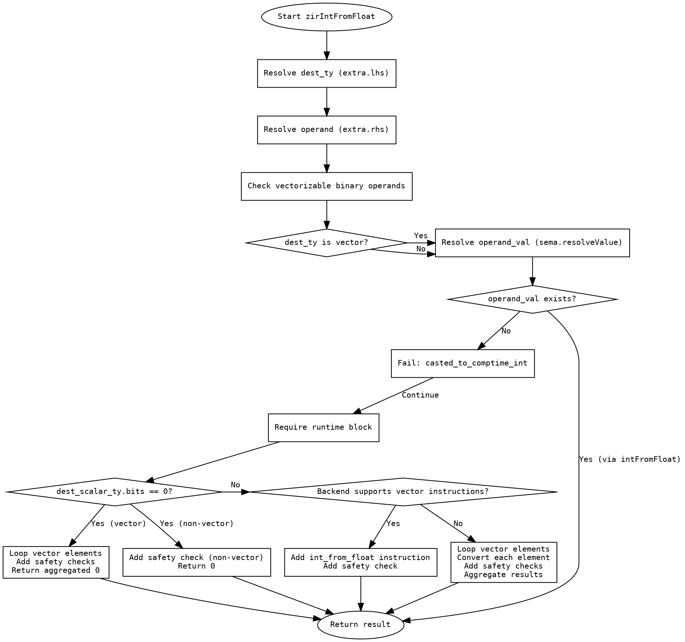

嗯，我现在需要帮用户分析这个Zig函数，并生成一个Graphviz的流程图。首先，我应该仔细阅读这段代码，理解它的结构和逻辑流程。

这个函数名为zirIntFromFloat，看起来是处理将浮点数转换为整数的操作。函数参数包括Sema、Block和Zir指令索引，返回一个Air指令引用或者编译错误。代码里有很多条件判断和错误检查，比如检查类型、处理向量化操作、安全验证等。

我需要确定函数的主要分支。首先，函数会解析目标类型和操作数，检查类型是否正确（整数和浮点数）。然后，尝试解析操作数的值，如果成功，就调用intFromFloat方法生成结果。如果目标类型是comptime_int，可能会失败并提示需要编译时计算。接着，函数处理运行时的情况，特别是当目标类型的位数为0时，可能有不同的处理方式，比如生成零值并进行安全检查。对于向量类型，需要循环处理每个元素，确保每个元素符合安全条件。如果向量指令不被后端支持，可能需要逐个元素处理并聚合结果。

接下来，我需要将这些逻辑步骤转化为流程图。流程图应该包括开始节点、结束节点、各个处理步骤、条件判断（比如if/else）、循环结构（比如for循环处理向量元素），以及可能的错误处理路径。需要注意各个条件分支的连接，以及循环的入口和出口。

需要注意的是，Graphviz使用的是DOT语言，节点用形状表示，箭头表示流程走向。条件判断通常用菱形节点，处理步骤用矩形，开始和结束用椭圆形。循环结构可能需要用子图或者适当的节点连接来表示。

可能存在的一些挑战是正确识别所有条件分支，尤其是嵌套的条件和循环。例如，在处理目标类型位数是否为0时，有多个嵌套的条件判断，同时还有向量和非向量情况的处理。此外，安全检查和不同优化模式（optimized vs非optimized）的处理也可能增加流程图的复杂度。

我需要确保每个条件判断都有对应的两个分支（true和false），并且每个处理步骤正确连接到后续的节点。对于循环部分，如处理向量元素的for循环，应该有一个循环开始节点，然后循环体内的步骤，最后回到循环条件或继续后续流程。

最后，生成DOT代码时，要正确使用节点和边的定义，确保结构清晰，避免交叉连线过多，保持可读性。可能需要使用rankdir=TB来保持垂直布局，或者LR如果水平布局更合适。同时，合理使用子图来分组相关的处理步骤，比如向量处理部分。
================================================
