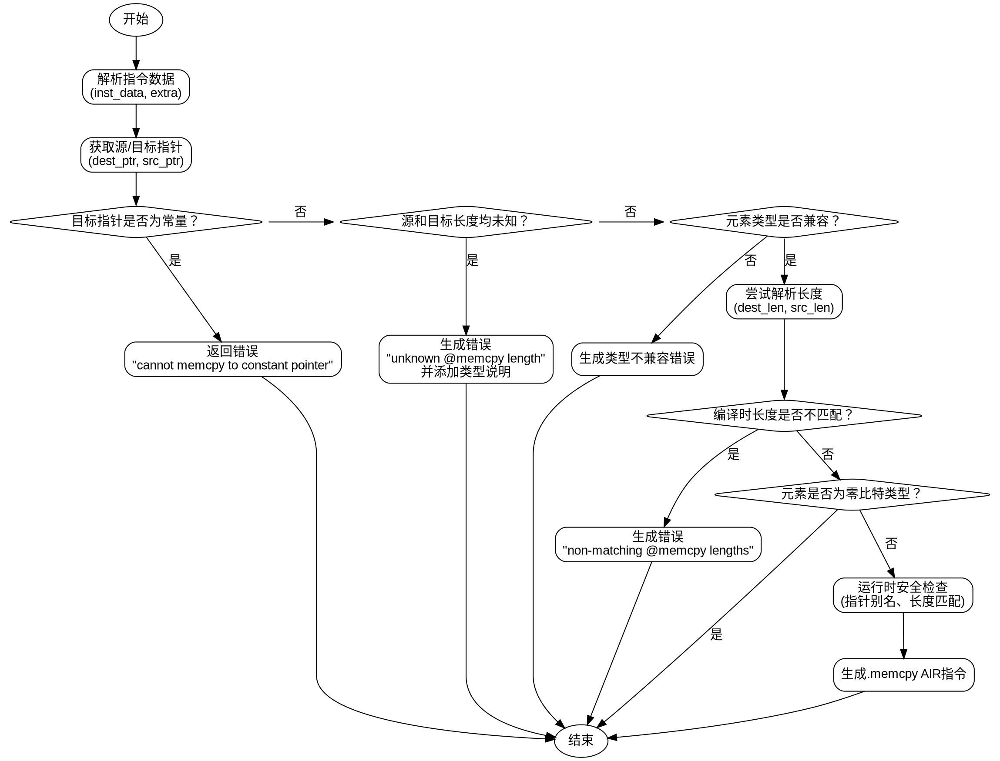

嗯，用户让我用Graphviz来画这个Zig函数的流程图。首先，我需要理解这个函数的结构。函数是zirMemcpy，看起来是处理内存复制的语义分析。代码里有很多条件判断和错误处理，比如检查指针是否为常量、长度是否匹配、类型是否兼容等等。

首先，我得确定函数的主要流程。函数开始于获取指令数据，解析参数，然后检查各种错误情况，比如目标指针是否是常量指针，源和目标长度是否已知，元素类型是否兼容等。接着处理运行时的情况，比如指针别名检查、安全验证，最后生成相应的指令。

接下来，我需要把每个步骤转化为流程图中的节点。每个条件判断（如if语句）会成为决策节点，分支到不同的路径。错误处理的部分可能通过不同的节点表示，比如返回错误信息。

需要注意循环和递归的情况，但在这个函数里似乎没有明显的循环，主要是条件分支。另外，函数中有多个可能的返回点，每个返回点需要连接到终止节点。

然后，我需要确定各个节点之间的连接关系。例如，检查目标指针是否为常量指针如果是，则进入错误处理流程；否则继续下一步。类似地，处理长度是否已知，类型是否兼容等。

还要注意，有些代码块可能包含多个步骤，比如在检查长度是否匹配时，如果编译时已知长度不匹配，则生成错误消息；否则在运行时添加安全检查。这些都需要分解成不同的节点。

最后，确保流程图的正确性，避免遗漏重要的分支，特别是错误处理的部分。可能需要多次检查代码，确保每个条件都被正确映射到流程图中。

现在，我需要把这些思考整理成一个结构化的流程图，使用Graphviz的语法来表示各个节点和边。每个处理步骤用矩形框，条件判断用菱形框，开始和结束用椭圆形框。边上的标签需要说明条件，例如“是”或“否”。
================================================
