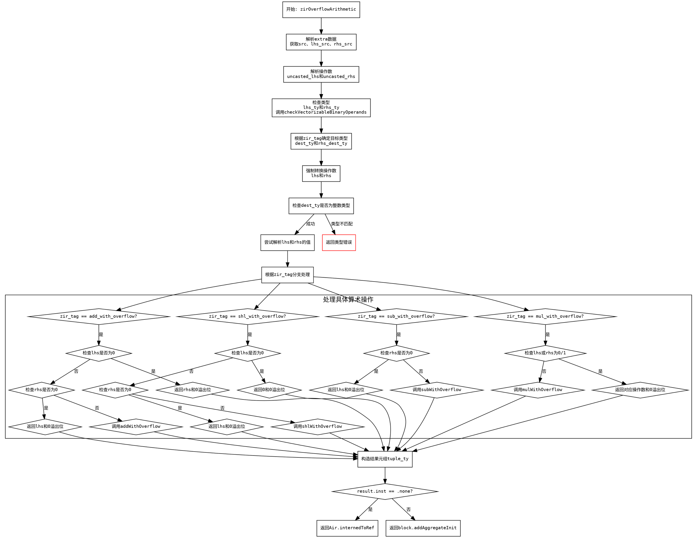

好的，我需要为给定的Zig函数`zirOverflowArithmetic`绘制一个流程图。首先，我需要理解这个函数的结构和逻辑流程。

首先，函数开始于解析一些参数，比如`extra`、`src`、`lhs_src`、`rhs_src`，然后解析左右操作数`uncasted_lhs`和`uncasted_rhs`。接着确定它们的类型`lhs_ty`和`rhs_ty`，并进行一些检查，比如`checkVectorizableBinaryOperands`。

然后根据`zir_tag`的不同，处理不同的溢出算术操作，比如加法、减法、乘法和左移。每种操作都有特定的逻辑，比如处理零值、未定义值，以及调用相应的算术函数（如`addWithOverflow`、`subWithOverflow`等）。

在处理完具体操作后，根据结果构造一个元组类型`tuple_ty`，并处理可能的运行时的指令添加，最后返回相应的结果或聚合初始化。

接下来，我需要将这些步骤转化为流程图。流程图的开始是函数入口，然后按照代码的执行顺序分步骤处理。每个条件判断（比如不同的`zir_tag`）会产生分支，每个分支处理不同的操作。需要注意各个条件分支和可能的返回路径，比如提前返回或构造结果。

需要特别注意错误处理和提前返回的情况，比如`sema.fail`可能会直接返回错误。此外，处理不同算术操作时的条件判断（如检查操作数是否为零或未定义）也需要在流程图中体现。

最后，流程图的结束点应该是函数的返回语句，可能有两种情况：返回`Air.internedToRef`的结果或者通过`block.addAggregateInit`返回聚合初始化的结果。

在绘制时，使用Graphviz的DOT语言，每个步骤用节点表示，条件判断用菱形节点，箭头表示流程方向。确保所有可能的路径都被覆盖，并且逻辑清晰。
================================================
