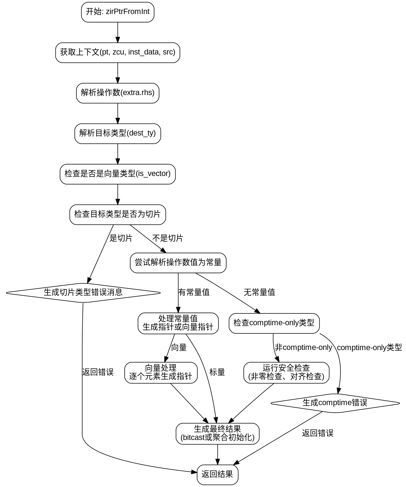

嗯，用户让我用Graphviz来画这个Zig函数的流程图。首先，我需要理解这个函数的结构和逻辑流程。这个函数叫做zirPtrFromInt，看起来是用来处理指针从整数转换的语义分析。

首先，函数开始时会获取一些上下文信息，比如pt、zcu、inst_data、src等。接着，它解析操作数的源和结果，检查类型是否匹配，特别是目标类型dest_ty。然后处理向量类型的情况，如果是向量，会生成对应长度的usize类型。

接下来，函数检查目标指针类型是否是切片类型，如果是的话会报错，因为整数不能直接转成切片。然后，如果操作数是已知的常量值，会生成对应的指针值；如果是运行时的值，会进行一系列的安全检查，比如非零检查和对齐检查。

在处理向量时，函数会逐个元素进行处理，确保每个元素都符合安全要求。最后，根据是否是向量类型，生成相应的聚合初始化结果。

现在需要将这些步骤转化为流程图。流程图应该包括开始、各个条件判断（比如是否是向量类型、是否是切片类型、是否是常量值等）、对应的处理步骤，以及可能的错误处理路径。

需要注意的是，函数中有多个条件分支，比如if (is_vector)、if (ptr_ty.isSlice(zcu))、if (try sema.resolveDefinedValue(...))等。每个条件分支都需要在流程图中体现出来，包括它们的处理逻辑和后续流程。

另外，错误处理部分，比如返回错误信息，也需要在流程图中标注。同时，函数末尾的不同返回路径，比如返回bitcast或者聚合初始化，也要区分清楚。

可能需要将整个流程分解为多个节点，并用箭头连接表示执行顺序。需要确保每个条件判断都有两个分支（是/否），并连接到相应的处理步骤。同时，处理步骤中的循环（比如for循环处理向量元素）可以用子流程或者节点内的注释来表示。

最后，使用Graphviz的DOT语言来编写这个流程图，确保节点和边的正确连接，以及标签的准确性。
================================================
