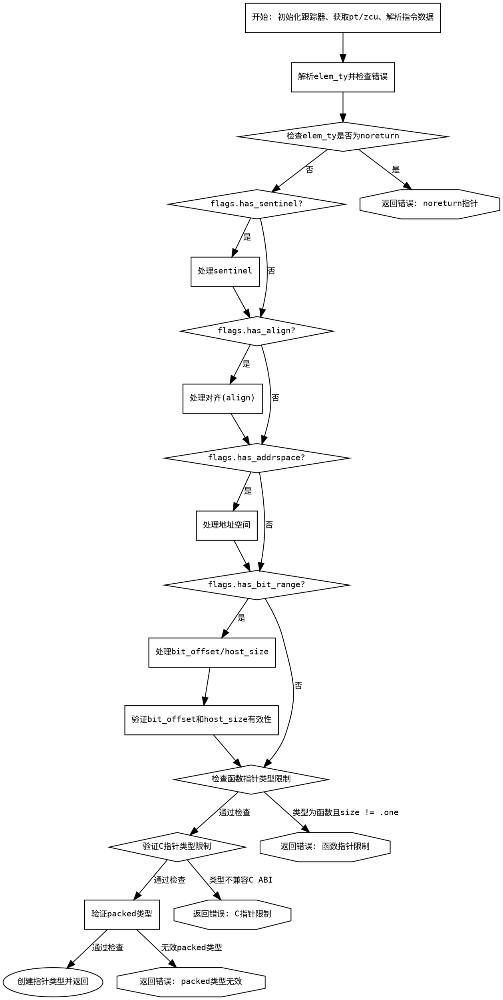

好的，我现在需要为给定的Zig函数`zirPtrType`绘制一个流程图。首先，我需要理解这个函数的结构和逻辑流程。这个函数的主要作用似乎是处理指针类型的语义分析，包括检查各种指针属性如对齐、地址空间、位偏移等。

首先，我会通读整个函数，识别主要的步骤和条件分支。函数开始于一些初始化操作，比如获取跟踪器、解析指令数据等。然后，它处理元素类型`elem_ty`，并进行错误检查，比如不允许指向`noreturn`类型的指针。

接下来，函数处理各种指针属性：是否有哨兵值（sentinel）、对齐（align）、地址空间（address space）、位偏移（bit offset）和主机大小（host size）。每个属性都可能存在或不存在，根据`inst_data.flags`中的标志来决定是否处理。每个处理步骤都可能引发错误，需要相应的错误处理。

在处理完所有属性后，函数会进行一些额外的验证，比如检查位偏移是否超出主机大小允许的范围，或者函数指针是否只能是单一指针。最后，构造指针类型`ty`并返回结果。

接下来，我需要将这些步骤转化为流程图中的节点。每个主要操作或条件判断对应一个节点。例如：

1. 开始：初始化操作（tracy跟踪，获取pt、zcu等）。
2. 解析elem_ty并进行错误检查。
3. 检查elem_ty是否为noreturn，如果是则报错。
4. 处理sentinel（如果有）。
5. 处理align（如果有）。
6. 处理address space（如果有）。
7. 处理bit offset和host size（如果有）。
8. 验证host size和bit offset的有效性。
9. 检查elem_ty是否为函数类型，验证指针大小。
10. 对于C指针，验证元素类型是否符合要求。
11. 验证packed类型。
12. 创建指针类型并返回。

每个条件判断（如`inst_data.flags.has_sentinel`）会导致不同的分支。例如，处理sentinel的部分仅在`has_sentinel`标志为真时执行。

需要注意的是，某些步骤可能包含嵌套的条件或循环，但在这个函数中，大部分是顺序处理，带有条件判断。例如，处理align时，如果有align标志，则执行相关代码，否则跳过。

在绘制流程图时，应该使用矩形表示操作步骤，菱形表示条件判断，箭头表示流程方向。每个条件分支（如“是”或“否”）需要明确标注。

可能遇到的挑战是处理多个条件分支的嵌套关系，比如在处理完sentinel后处理align，每个都可能存在或不存在。需要确保所有可能的路径都被正确表示，特别是错误处理路径（如返回错误）。

另外，错误处理部分（如`return sema.fail(...)`）应该在流程图中体现为终止节点或错误出口。

最后，确保流程图的逻辑与代码完全一致，没有遗漏任何关键步骤或条件。这可能需要多次检查代码和流程图之间的对应关系。
================================================
