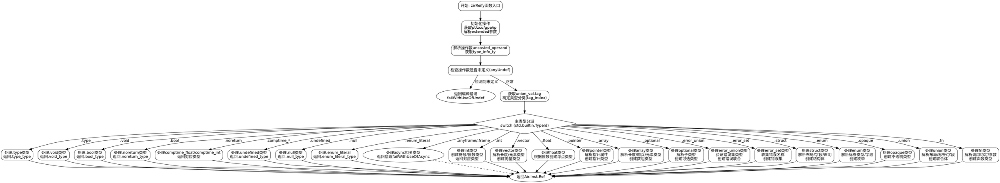

好的，我现在需要帮用户用Graphviz画出一个Zig函数的流程图。用户提供的代码是`fn zirReify`函数，看起来相当复杂，有很多条件判断和分支处理。我的第一步是理解这个函数的结构，然后将其转化为流程图。

首先，我需要通读代码，了解函数的整体流程。函数`zirReify`接受几个参数，包括Sema、Block、Zir指令等，返回一个Air指令引用或者编译错误。函数内部处理不同类型的Zir指令，根据不同的类型执行不同的逻辑，比如处理整数、浮点数、指针、数组、结构体、枚举、联合体等。

接下来，我需要确定流程图的主要节点和分支。函数开始于一些初始化操作，比如获取各种上下文和解析指令。然后进入一个大的switch语句，根据不同的类型ID进行处理。每个case对应一种类型，执行相应的逻辑，并可能返回不同的结果或错误。

需要注意的点：
1. 函数开始部分的初始化步骤。
2. 解析操作数并获取类型信息。
3. 检查未定义值，处理错误。
4. 根据类型ID的不同，进入不同的处理分支。
5. 每个分支内部的具体处理逻辑，可能包含子条件判断。
6. 错误处理，比如返回错误信息。
7. 最终返回对应的Air指令引用。

接下来，我需要将这些步骤转化为Graphviz的节点和边。每个主要步骤作为一个节点，条件判断作为分支节点，不同的case作为子分支。需要确保流程图的逻辑清晰，层次分明，避免过于拥挤。

可能的结构：
- 开始节点：初始化步骤。
- 解析操作数和类型信息。
- 检查未定义值，可能进入错误处理。
- 主switch节点，根据类型ID分支出不同的处理流程。
- 每个类型处理分支内部的具体步骤，可能包含子条件或错误检查。
- 结束节点：返回相应的结果。

需要注意处理错误路径，比如当检测到未定义值或不符合条件时，直接返回错误节点。每个case分支结束后应指向对应的返回节点。

此外，代码中有很多嵌套的条件判断，比如在处理指针类型时检查各种属性（大小、对齐、地址空间等），这些可能需要细化为子流程图或更详细的节点。

不过，由于Graphviz流程图不宜过于复杂，可能需要适当简化，将每个主要case作为一个节点，内部细节可以合并，除非用户特别强调需要详细展开。

最后，确保所有的流程路径都被覆盖，包括错误处理和正常返回。可能需要多次调整节点和连接，以确保逻辑正确性和可读性。
================================================
