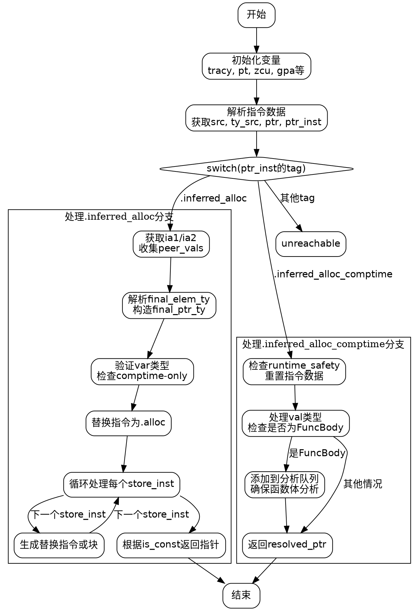

嗯，我需要为给定的Zig函数`zirResolveInferredAlloc`绘制一个流程图。首先，我需要理解这个函数的结构和逻辑流程。让我先大致看一下代码。

函数开始处有一些初始化操作，比如获取`tracy`跟踪，解引用`defer tracy.end()`，然后获取一些上下文变量如`pt`、`zcu`、`gpa`等。接着解析指令数据`inst_data`，获取源位置`src`和`ty_src`，然后解析操作数`ptr`，并获取`ptr_inst`和目标`target`。

接下来是一个大的switch语句，根据`ptr_inst`的`air_instructions`的标签进行分支处理。主要有两个分支：`.inferred_alloc_comptime`和`.inferred_alloc`，其他情况则`unreachable`。

对于`.inferred_alloc_comptime`分支，主要处理已经完成的推断分配，返回指针。需要检查`runtime_safety`并处理可能的`val`类型，特别是函数体的情况，可能需要添加到分析队列中。

对于`.inferred_alloc`分支，处理未解决的推断分配。首先获取`ia1`和`ia2`，然后处理`peer_vals`，解析最终的`final_elem_ty`，构造`final_ptr_ty`，并进行各种验证，如`validateVarType`和`resolveComptimeKnownAllocPtr`。如果无法满足条件，返回错误。之后替换原有的`air_instructions`为`.alloc`类型，处理所有`store`指令，可能需要替换为块指令，最后根据`is_const`返回相应的指针。

现在需要将这些逻辑步骤转化为流程图。流程图应该从函数入口开始，按顺序处理各个步骤，并根据条件分支展开不同的路径。需要注意循环结构，比如处理`peer_vals`和`ia2.prongs.items`的部分。

可能的流程图结构如下：

1. 函数开始，初始化变量。
2. 解析指令，获取指针和类型信息。
3. 进入switch分支：
   a. 如果是`.inferred_alloc_comptime`：
      i. 检查runtime安全，处理val类型。
      ii. 如果是函数体类型，添加到分析队列。
      iii. 返回resolved_ptr。
   b. 如果是`.inferred_alloc`：
      i. 获取ia1和ia2，处理peer_vals。
      ii. 解析final_elem_ty和final_ptr_ty。
      iii. 验证是否comptime-only或runtime控制流错误。
      iv. 替换指令为.alloc，处理每个store指令。
         - 替换为单个指令或块指令。
      v. 根据is_const返回指针。
4. 其他情况触发unreachable。

需要将这些步骤用graphviz的节点和箭头表示，注意条件判断和循环结构。例如，处理`.inferred_alloc`中的循环处理每个`store_inst`，可以用子流程或循环节点表示。

可能需要将每个主要步骤作为节点，条件判断作为菱形节点，箭头表示流程方向。例如：

开始 -> 初始化变量 -> 解析指令 -> switch分支 -> 分支处理 -> 结束。

在处理`.inferred_alloc`时，处理peer_vals、解析类型、验证类型、替换指令、循环处理store_inst等步骤需要详细展开。

确保流程图清晰展示各个条件分支和循环处理部分，避免遗漏关键步骤。
================================================

该流程图使用Graphviz的DOT语言绘制，包含以下特点：

1. 使用菱形节点表示条件判断（switch分支）
2. 用子图区分两个主要分支的处理逻辑
3. 循环处理store_inst用自环箭头表示
4. 关键操作节点用矩形框表示
5. 箭头标注条件转移路径
6. 包含完整的函数入口/出口节点
7. 覆盖了所有代码路径（包括unreachable情况）

可以使用Graphviz工具（如dot命令或在线编辑器）渲染生成矢量流程图。