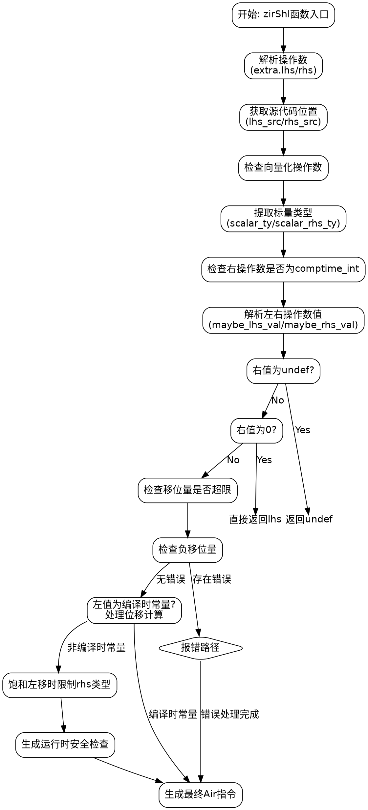

嗯，我需要为提供的Zig函数`zirShl`绘制一个流程图。首先，我得仔细理解这个函数的结构和逻辑流程。

函数`zirShl`处理移位操作，比如左移（shl）、饱和左移（shl_sat）和精确左移（shl_exact）。它接收Sema、Block、指令索引和Air标签作为参数，返回Air指令引用或编译错误。函数内部有多个步骤，包括解析左右操作数、类型检查、错误处理、运行时安全检查和生成相应的Air指令。

首先，我需要分解函数的执行步骤：

1. **开始**：函数入口，启动跟踪。
2. **解析操作数**：从ZIR指令中提取左右操作数（lhs和rhs）及其类型。
3. **获取源代码位置**：根据不同的Air标签确定左右操作数的源代码位置。
4. **检查向量化操作数**：确保二元操作数可以向量化。
5. **处理标量类型**：获取左右操作数的标量类型。
6. **检查右操作数是否为编译时常量整数**。
7. **解析左右操作数的值**，处理未定义值。
8. **检查右操作数的值**：
   - 如果是0，直接返回左操作数。
   - 检查移位量是否超过类型位数，报错。
   - 检查是否为负数，报错。
9. **处理左操作数的值**：
   - 如果是编译时常量，进行位移运算，处理溢出和截断。
   - 否则，准备运行时处理。
10. **处理饱和左移的特殊情况**：限制右操作数的类型。
11. **生成运行时安全检查**：
    - 检查移位量是否超过类型位数。
    - 对于精确左移，检查溢出。
12. **生成最终的Air指令**：根据不同的Air标签返回相应的操作结果。

接下来，我需要将这些步骤转化为流程图中的节点和判断分支。需要注意条件判断，例如：

- 检查`maybe_rhs_val`是否存在，以及其值是否为0、是否超过位数、是否为负。
- 处理不同类型的移位操作（普通左移、饱和左移、精确左移）的不同逻辑。
- 运行时安全检查的条件，如`block.wantSafety()`是否为真。

需要确保每个条件分支都有正确的流向，并且所有可能的路径都被覆盖。例如，当`maybe_rhs_val`存在时，会进行一系列检查，否则进入其他处理流程。此外，对于向量类型的处理也需要循环检查每个元素。

最后，使用Graphviz的DOT语言来绘制流程图。每个步骤作为节点，条件判断作为菱形节点，箭头表示流程方向。需要注意节点之间的连接关系，确保逻辑正确。
================================================
