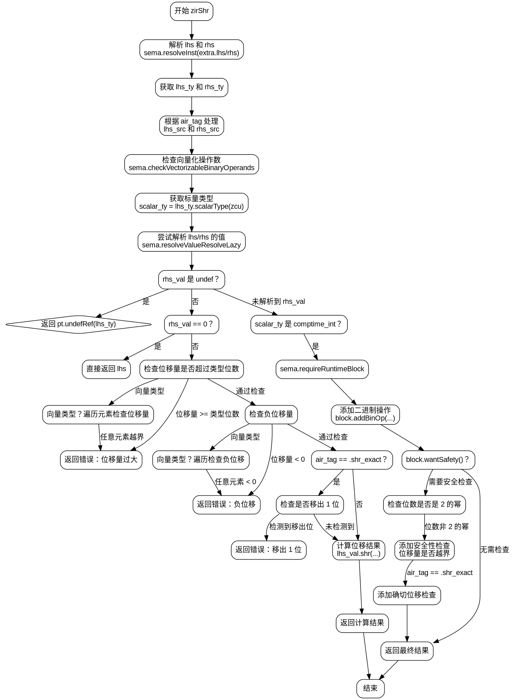

嗯，我需要为这个Zig函数zirShr画一个流程图。首先，我得理解这个函数的结构和逻辑流程。函数开始处有一些初始化和获取参数的步骤，比如获取lhs和rhs，然后检查它们的类型。接下来，处理不同的air_tag情况，比如.shr和.shr_exact，处理不同的源节点。然后检查向量化的操作数，确定标量类型。

之后，函数尝试解析lhs和rhs的值，如果有未定义的值，就返回undefRef。如果rhs是0，直接返回lhs。然后检查位移量是否超过类型允许的位数，或者在向量中的每个元素是否超过限制，如果有错误就返回相应的失败信息。

接下来，处理负数位移的情况，同样检查向量中的每个元素。如果有确切位移（shr_exact），需要检查是否移出了1的位，如果有的话也报错。然后计算位移后的值，并返回结果。

如果rhs的值不是编译时常量，需要运行时检查，添加二进制操作，并进行安全性检查，比如位移量是否超过位数，或者是否位移溢出。

我需要将这些步骤分解成流程图中的各个节点，判断条件和循环结构。例如，处理向量元素时有一个while循环，这在流程图中可能需要用条件分支和循环节点表示。同时，错误处理和返回路径也需要在流程图中体现。

需要注意的是，流程图中的每个判断点（比如是否rhs是0，是否位移量过大等）都要有对应的分支。另外，处理向量的部分可能需要多次检查每个元素，这可能需要循环结构。

可能的结构是：开始 -> 初始化参数 -> 解析lhs/rhs -> 检查类型 -> 处理不同air_tag -> 检查向量化操作数 -> 解析值 -> 各种条件判断（rhs是否为0，位移量是否过大，是否为负数，是否确切位移导致溢出） -> 生成结果或错误 -> 运行时检查和安全性处理 -> 结束。

需要确保所有可能的执行路径都被覆盖，包括错误返回和正常返回的情况。同时，循环结构如while循环处理向量元素，可能需要用条件判断和重复节点来表示。

最后，用Graphviz的DOT语言将这些步骤和判断连接起来，形成完整的流程图。
================================================
