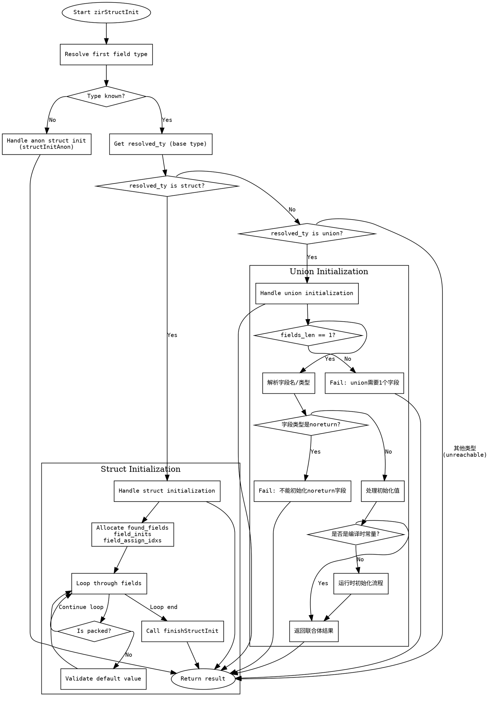

嗯，我需要为这个Zig函数zirStructInit绘制一个流程图。首先，我得仔细看看这个函数的逻辑。函数处理结构体和联合体的初始化，看起来有很多分支和条件判断。

首先，函数开始的时候会获取一些基本的数据，比如gpa、zir_datas、inst_data等。然后根据第一个字段的类型解析结果类型result_ty。如果类型未知，就调用structInitAnon进行处理。这部分应该是一个条件判断，形成一个分支。

接下来，检查解析后的类型resolved_ty是否是结构体（struct）。如果是结构体，会分配一些数组来跟踪字段的初始化和赋值情况，然后遍历所有字段，处理每个字段的初始化，并检查是否有重复字段或默认值是否符合。这部分可能涉及循环处理每个字段，并且在循环内部有多个条件判断，比如是否是打包结构体（packed），是否需要检查默认值等。

如果resolved_ty是联合体（union），则处理联合体的初始化，这里需要确保只有一个字段被初始化，并处理相关的类型检查和值赋值。这部分也是一个条件分支，当类型是联合体时执行不同的逻辑。

在联合体处理中，还要处理noreturn类型的字段，返回错误。同时，处理运行时值和编译时常量的情况，可能涉及到不同的代码路径，比如分配内存、设置标签、存储指针等。

整个函数最后会根据不同的情况返回不同的结果，比如调用finishStructInit或者返回联合体初始化的结果。

绘制流程图的时候，应该从函数入口开始，按照逻辑分支画出各个条件判断，比如是否是结构体或联合体，是否有未知类型等。对于结构体的处理，需要包含循环处理每个字段的流程，以及循环内的条件检查。联合体的处理则需要处理字段数量是否为1，字段类型是否为noreturn，以及不同的初始化路径。

需要注意不要遗漏错误处理的部分，比如返回错误信息的情况。同时，函数中有多个返回点，需要正确连接这些路径到流程图的结束节点。

可能需要将复杂的循环和条件拆分为子流程，以保持流程图的清晰。例如，处理结构体字段的循环可以作为一个子流程块，内部包含字段索引获取、类型检查、默认值验证等步骤。

最后，确保流程图符合Graphviz的语法，正确使用节点、箭头和条件分支的表示方法，比如菱形表示条件判断，矩形表示处理步骤，椭圆形表示开始和结束节点。
================================================
