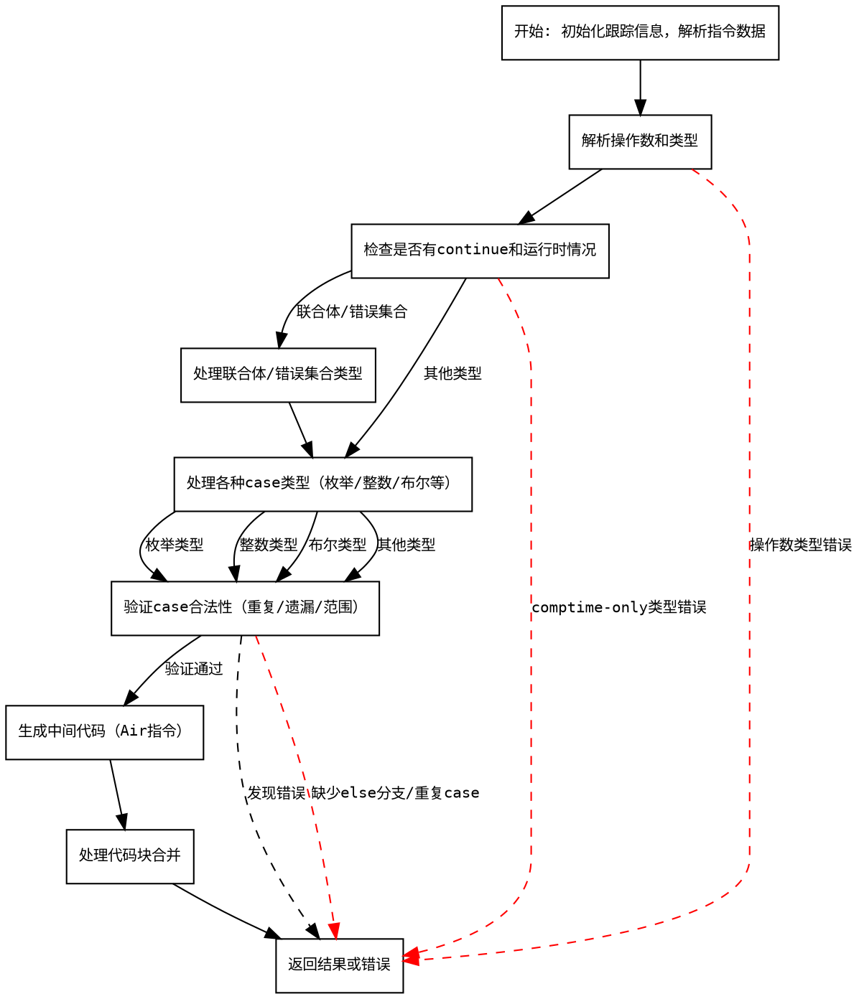

嗯，我现在需要为这个Zig函数`zirSwitchBlock`画一个流程图。首先，我得理解这个函数的结构和逻辑流程。看起来这个函数处理的是Zig编译器中的switch语句的语义分析，包括各种情况，比如枚举、整数、布尔值等类型的处理，还有错误检查、条件验证等等。

首先，函数开始时会做一些初始化工作，比如获取跟踪信息，解析指令数据，处理操作数类型。然后根据操作数的类型（比如是否是联合体、错误集合等）进行不同的处理。接着会验证各种case的情况，检查是否有重复的case，是否缺少else分支，处理范围检查等。之后，根据不同的类型（如枚举、整数、布尔等）进行具体的分析和验证，生成相应的中间表示（Air指令）。最后处理代码块合并和返回结果。

接下来，我需要把这些步骤分解成流程图中的各个节点。可能的节点包括：

1. 开始：初始化，获取跟踪信息。
2. 解析操作数和类型。
3. 检查是否有continue和运行时情况。
4. 处理不同类型的条件（枚举、错误集合、整数、布尔等）。
5. 验证case的合法性，处理重复和遗漏。
6. 生成中间代码（Air指令）。
7. 处理代码块合并和返回。

需要注意的是，函数中有很多条件分支，比如根据`cond_ty`的不同类型进入不同的处理逻辑，还有是否有else分支等。这些都需要在流程图中用判断节点表示。

可能遇到的困难是如何将复杂的条件分支和循环结构正确地表示出来，特别是处理不同case类型时的多分支情况。需要确保每个可能的路径都被覆盖，同时保持流程图的可读性。

另外，函数中有很多错误处理的情况，比如返回错误信息，这些也应该作为流程中的节点，比如“返回错误”或“生成错误消息”。

现在需要将这些步骤逐步转化为Graphviz的节点和边，使用合适的形状（如矩形表示过程，菱形表示判断，椭圆形表示开始/结束等）。需要确保每个判断节点都有明确的是/否分支，并且流程的顺序正确。

最后，检查是否有遗漏的步骤或逻辑错误，确保流程图准确反映函数的执行流程。
================================================
