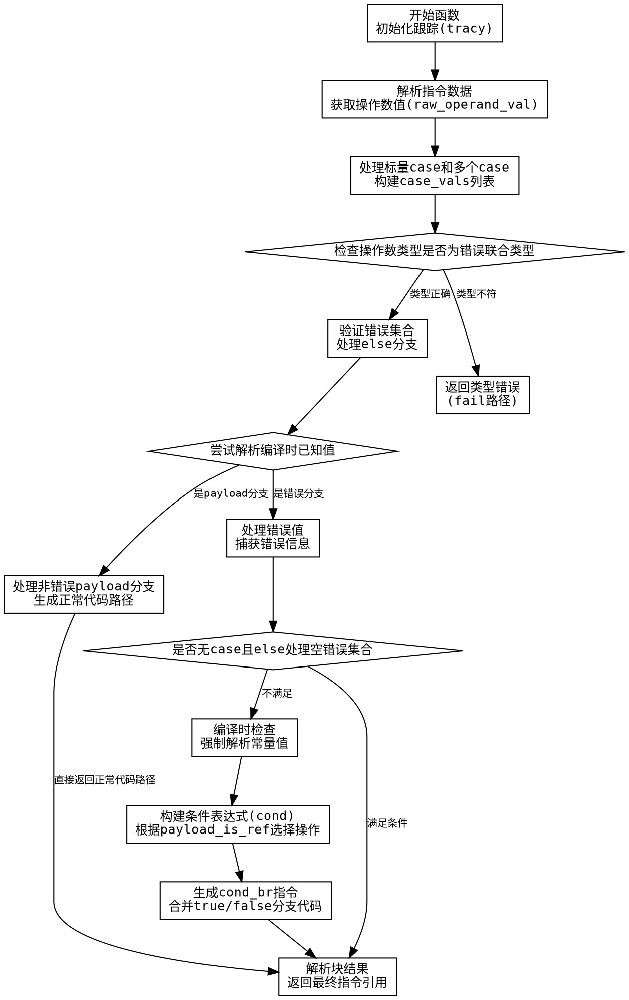

嗯，我需要为给定的Zig函数`zirSwitchBlockErrUnion`绘制一个流程图。首先，我需要理解这个函数的结构和逻辑流程。让我先大致看一下代码的结构。

函数开始处有一些初始化操作，比如获取跟踪信息、解引用指针、解析指令数据等。接着处理switch块的各个分支，包括标量case、多个case以及else分支。然后进行错误集合的验证，检查操作数类型是否为错误联合类型。之后处理错误捕获和条件分支，包括编译时和运行时的不同路径。最后生成AIR指令并解析块结果。

接下来，我需要将这些步骤分解成流程图中的各个节点。可能的步骤包括：

1. 函数开始，初始化跟踪和变量。
2. 解析指令数据，获取操作数值。
3. 处理标量case和多个case。
4. 检查操作数类型是否为错误联合类型。
5. 处理错误集合验证。
6. 判断是否为编译时已知值，处理对应的路径。
7. 处理非错误情况的分支。
8. 处理运行时条件分支，生成cond_br指令。
9. 结束函数，返回结果。

需要注意条件判断的分支，比如操作数是否为错误联合类型，是否有else分支，是否在编译时已知值等。每个条件判断会引出不同的流程路径。

现在需要将这些步骤组织成流程图，使用Graphviz的DOT语言。每个节点代表一个步骤，边代表流程的走向。条件判断使用菱形节点，处理不同的分支情况。

可能会遇到的挑战是正确捕捉所有的条件分支和循环结构，确保流程图准确反映代码的逻辑。需要仔细检查每个if/else块和循环，确保在流程图中正确表示。

另外，需要注意代码中的错误处理和提前返回的情况，这些可能形成流程中的终止节点或提前退出路径。

最后，确保流程图的结构清晰，节点和边标签明确，便于理解函数的执行流程。
================================================
