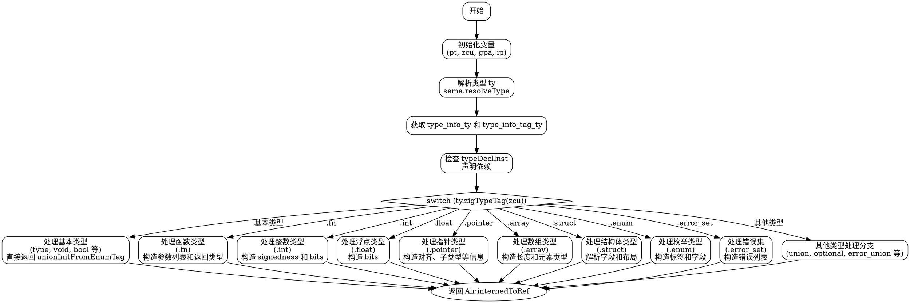

嗯，用户让我用graphviz来画这个Zig函数的流程图。首先，我需要理解这个函数的结构。函数名为zirTypeInfo，看起来是处理类型信息的，里面有很多switch case，每个case对应不同的类型标签，比如.int、.float、.pointer等等。每个case里面都有一些处理逻辑，最后返回Air.internedToRef的结果。

流程图的话，应该从函数入口开始，然后根据不同的类型标签分支到不同的处理块。每个分支内部可能有多个步骤，比如获取内置类型、处理参数、构造值等。不过要注意，graphviz的流程图需要节点和边，不能太复杂，否则会难以阅读。

首先，函数开始部分有一些初始化的步骤，比如获取pt、zcu、gpa等。然后解析类型，获取type_info_ty和type_info_tag_ty。接着检查是否有typeDeclInst，如果有的话声明依赖。之后进入一个大的switch语句，根据不同的zigTypeTag处理不同的类型。

每个case里面可能有很多操作，比如.int的处理需要获取int_info_ty、signedness_ty，然后构造字段值，最后返回。类似地，.pointer的情况处理指针信息，包括大小、对齐、子类型等。

需要将这些分支作为不同的子流程。可能每个case作为一个节点，然后内部的操作作为子节点。但这样可能会让图太庞大。或者，将每个case作为一个分支节点，然后连接相应的处理步骤和返回节点。

需要注意的是，有些case会调用其他函数，比如sema.getBuiltinType、pt.intValue、pt.internUnion等，这些可能在流程图中作为处理步骤。

另外，最后的返回部分可能统一处理，或者每个case有自己的返回路径。不过代码中每个case最后都返回Air.internedToRef，所以可能在每个分支结束处直接返回。

还要注意错误处理，比如try可能会抛出错误，但流程图中是否需要体现？用户可能主要关注正常流程，所以可能忽略错误路径。

综上，流程图的大致结构是：

1. 函数入口
2. 初始化变量（pt, zcu, gpa等）
3. 解析类型ty
4. 获取type_info_ty和type_info_tag_ty
5. 检查typeDeclInst，声明依赖
6. 根据ty的zigTypeTag进入不同的分支（如.int、.float等）
7. 每个分支处理对应的类型信息，构造相应的值
8. 返回Air.internedToRef

接下来需要用graphviz的dot语言来表示这些步骤。可能将每个case作为一个子图，或者用不同的节点表示。不过为了简洁，可能将switch作为一个决策节点，然后每个case作为分支，每个分支包含关键步骤，最后合并到返回节点。

需要注意的是，代码中有很多嵌套的switch case，比如处理struct、enum等复杂类型，这些可能需要更详细的子流程。但为了保持流程图的可读性，可能需要简化，只显示主要步骤，而不是每一行代码。

最后，确保使用正确的graphviz语法，比如使用digraph，定义节点和边，使用形状如矩形、菱形等表示不同步骤和决策点。
================================================
