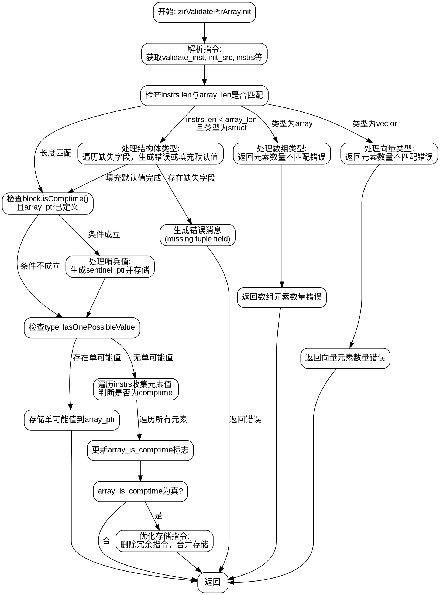

好的，我现在需要为给定的Zig函数`zirValidatePtrArrayInit`绘制一个流程图。首先，我需要仔细阅读并理解这段代码的功能和结构，这样才能准确地将代码逻辑转化为流程图。

首先，函数`zirValidatePtrArrayInit`似乎是用于验证指针数组的初始化过程。它接收`*Sema`、`*Block`和`Zir.Inst.Index`作为参数，并返回可能的编译错误。函数的主要步骤包括解析指令、处理数组元素、检查编译时值、处理结构体、数组、向量等不同类型，以及处理存储指令等。

接下来，我需要分解函数的各个部分，识别主要的控制流节点，如条件判断、循环、错误处理等。例如：

1. **初始化和解析指令**：获取各种指令和数据，如`validate_inst`、`init_src`、`instrs`等。
2. **检查数组长度与指令数量是否匹配**：如果不匹配，根据数组类型（结构体、数组、向量）生成不同的错误信息。
3. **处理编译时已知的数组**：如果数组在编译时已知，处理哨兵值（sentinel）或单可能值。
4. **收集元素值**：遍历指令，确定每个元素是否为编译时已知，处理可能的位转换和存储指令。
5. **处理编译时数组**：如果所有元素都是编译时已知，优化存储指令，合并为单个存储操作。

在绘制流程图时，需要注意各个条件分支，如`if (instrs.len != array_len)`下的不同类型处理，`block.isComptime()`的判断，以及循环结构如`for (instrs, 0..)`和`while (i < array_len)`等。

可能的节点和流程包括：

- 开始节点：函数入口。
- 解析指令和初始化变量。
- 检查数组长度是否匹配，若不匹配则根据不同数组类型处理错误。
- 处理编译时数组，包括哨兵值的处理。
- 检查数组是否只有一个可能值，直接存储。
- 遍历每个元素指令，判断是否为编译时已知，更新相关标志。
- 最终根据`array_is_comptime`标志决定是否优化存储指令。

需要特别注意错误处理流程，如`errdefer`块和`return sema.fail`等路径。此外，循环和条件判断之间的跳转关系也需要清晰表达。

现在，我需要将这些步骤转化为Graphviz的DOT语言，使用合适的节点、条件判断框、循环结构、错误处理路径等元素。确保每个判断分支正确连接，流程逻辑与代码一致，没有遗漏重要步骤。
================================================

该流程图使用Graphviz DOT语言绘制，完整展示了函数的控制流：

1. **初始解析指令**后进入主逻辑分支
2. **数组长度检查**分支出错误处理或继续执行
3. **编译时检查**决定是否处理哨兵值
4. **单可能值检查**直接存储或继续收集元素
5. **元素遍历**更新编译时标志
6. 最终根据标志决定是否优化存储指令

关键路径用条件标签标注，错误处理路径单独分离，循环逻辑简化为遍历节点。