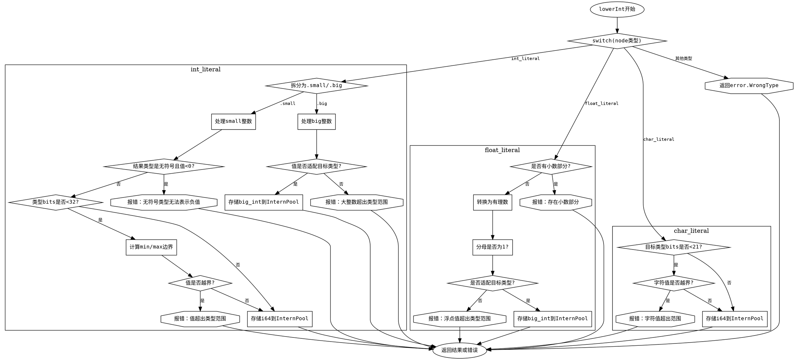

好的，我需要为给定的Zig函数生成一个流程图，使用Graphviz的DOT语言。首先，我需要理解这个函数的结构和逻辑流程。

函数名为`lowerInt`，接收三个参数：`self`指针、`node`和`res_ty`，返回一个`InternPool.Index`或错误。函数的主要逻辑是通过匹配`node`的不同类型来处理不同的情况。

首先，函数使用`@setFloatMode(.strict);`，这可能与浮点运算有关，但暂时不影响流程图的结构。接下来是一个`switch`语句，根据`node.get(self.file.zoir.?)`的结果进行分支处理。

分析各个分支：

1. **.int_literal**：分为`.small`和`.big`两种情况。
   - **.small**：处理较小的整数值。检查结果类型是否为整数类型，并进行边界检查。如果不符合条件，返回错误；否则，将结果存入InternPool。
   - **.big**：处理较大的整数值，同样进行类型检查和范围验证，然后存储。

2. **.float_literal**：处理浮点数值。检查是否有小数部分，如果有则报错。然后将浮点数转换为有理数形式，验证是否符合目标整数类型的要求，最后存储。

3. **.char_literal**：处理字符字面量。检查是否超出目标整数类型的范围，若超出则报错，否则存储。

4. **else**：返回错误`error.WrongType`。

接下来，需要将这些逻辑步骤转化为流程图的结构。每个分支对应不同的处理路径，包括条件判断和可能的错误返回。

需要注意的细节：
- 每个case分支中的条件判断，如`if (res_ty.zigTypeTag(...) == .int)`，需要表示为流程图中的决策节点。
- 错误处理（如`self.fail(...)`）应作为流程中的终止节点。
- 成功路径最终调用`self.sema.pt.intern(...)`并返回结果。

开始绘制流程图的大纲：

1. 入口点：函数开始。
2. 根据`node`类型分支到不同的处理块。
3. 每个处理块内部的条件判断和可能的错误路径。
4. 成功处理后的返回路径。
5. 其他情况返回错误。

确保每个判断节点都有两个出口（是/否），错误路径直接指向终止节点，而成功路径继续后续处理。

可能的结构：

- 主分支根据node类型分为int_literal、float_literal、char_literal、else。
- int_literal分支进一步分为small和big。
- 每个子分支内部进行条件检查，可能导致错误或继续处理。
- 所有成功路径最终汇聚到存储并返回的节点。

最后，使用DOT语法描述这些节点和边，使用矩形表示处理步骤，菱形表示条件判断，椭圆形表示开始/结束节点。
================================================
