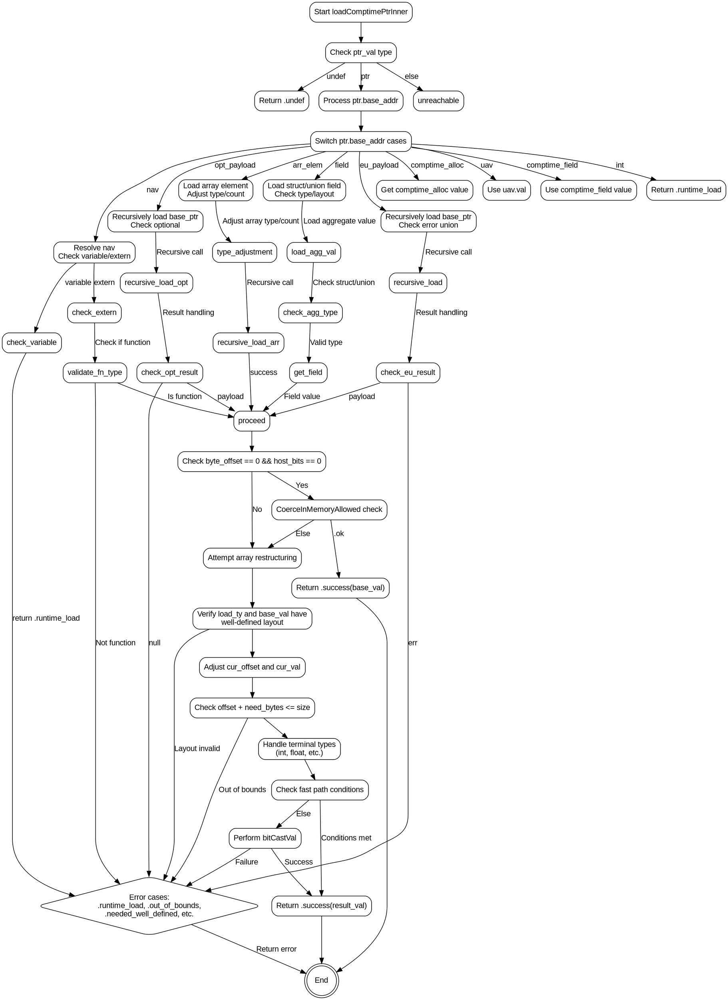

嗯，用户让我用Graphviz来画这个Zig函数的流程图。首先，我需要理解这个函数的结构。函数是loadComptimePtrInner，看起来处理编译时的指针加载，返回一个ComptimeLoadResult。里面有很多switch和条件判断，不同的路径处理不同的情况，比如指针类型、数组、结构体、联合体等。

首先，我应该从函数的入口开始，逐步分解每个主要步骤。函数一开始检查ptr_val的类型，可能是undef、ptr或者其他情况。接着处理不同的base_addr类型，比如nav、comptime_alloc、uav等等，每个case有不同的处理逻辑。之后，根据ptr的byte_offset和host_bits等参数，决定是否可以直接返回base_val，或者需要进一步处理数组、结构体等复杂类型。

接下来，处理数组的情况，可能需要调整数组的长度或结构。如果无法直接匹配，会检查内存布局是否明确，如果不够明确则返回错误。然后，处理可能的内存重新解释，考虑偏移量和元素大小，可能需要深入数组或结构体的子元素。

在流程图中，每个条件判断应该是一个菱形节点，不同的分支指向不同的处理块。比如，处理ptr.base_addr的不同类型时，每个case对应一个分支。需要注意循环结构，比如处理数组时的while循环，可能需要用条件节点和循环结构来表示。

需要注意的是，函数中有多处错误处理，比如返回runtime_load、undef、out_of_bounds等，这些应该在流程图中作为终止节点或分支结果。另外，递归调用loadComptimePtrInner的情况，比如处理eu_payload和opt_payload时，可能需要用子流程或者递归节点表示。

可能遇到的问题是如何将复杂的switch和嵌套条件转换为清晰的流程图结构。特别是处理数组和结构体时的多层条件判断，需要合理组织节点，避免交叉和混乱。另外，确保所有可能的路径都被覆盖，包括错误返回和正常返回的情况。

最后，生成Graphviz的DOT代码时，需要定义各个节点和边，使用合适的标签，如条件判断、处理步骤、返回结果等。可能需要对代码进行分段处理，每个主要代码块对应一个流程图节点，条件分支用边连接。
================================================
