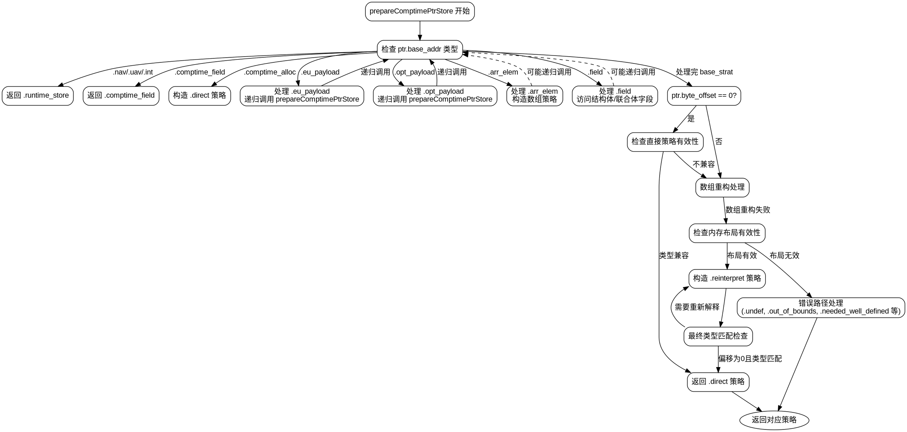

嗯，用户让我用Graphviz来画这个Zig函数的流程图。首先，我需要理解这个函数的结构。这个函数叫做prepareComptimePtrStore，看起来处理的是编译时的指针存储策略。函数内部有很多switch和递归调用，结构比较复杂。

首先，我应该从头开始分析函数的执行流程。函数开始部分，通过switch处理不同的ptr.base_addr情况，比如.nav、.uav、.int返回.runtime_store，.comptime_field返回.comptime_field，.comptime_alloc处理直接分配，还有处理.eu_payload、.opt_payload、.arr_elem、.field等情况。每个case里面可能有进一步的逻辑，比如递归调用prepareComptimePtrStore。

接下来，处理完base_strat后，函数检查ptr.byte_offset是否为0，并根据store_ty的类型（是否是数组）进行不同的处理。这里可能涉及到类型检查和内存布局的判断。

然后进入restructure_array部分，处理数组的重构，比如改变数组的长度或结构。这里需要考虑元素类型、偏移量和数组长度，可能会返回.flat_index或.index策略。

如果前面的步骤无法处理，函数会检查是否需要重新解释内存布局，这里会验证store_ty和当前值的类型是否有明确的内存布局。如果不符合条件，返回相应的错误策略。

最后，处理可能的终端类型（如基本类型），检查是否可以直接使用direct策略，或者需要返回reinterpret策略。

画流程图的时候，需要将这些主要步骤作为节点，条件判断作为分支。需要注意的是递归调用部分，比如在处理.eu_payload和.opt_payload时，会递归调用prepareComptimePtrStore，这可能需要用子流程或者单独的节点来表示。

可能遇到的困难是如何将复杂的条件分支和递归调用清晰地表示出来。需要确保每个case的处理流程清晰，并且不同路径之间的转换正确。此外，函数中有很多错误处理路径，比如返回.out_of_bounds或.needed_well_defined，这些也需要在流程图中体现。

另外，要注意函数中的循环结构，比如最后的while循环，处理不同类型的结构体、联合体等，需要正确表示循环内的判断和可能的退出条件。

总结下来，流程图应该从函数入口开始，按照不同的case分支展开，处理每个可能的base_addr类型，然后处理后续的类型检查和内存布局判断，最后根据不同的情况返回相应的策略。需要确保每个判断节点和操作步骤都正确连接，并且递归调用部分用适当的子流程表示。
================================================
