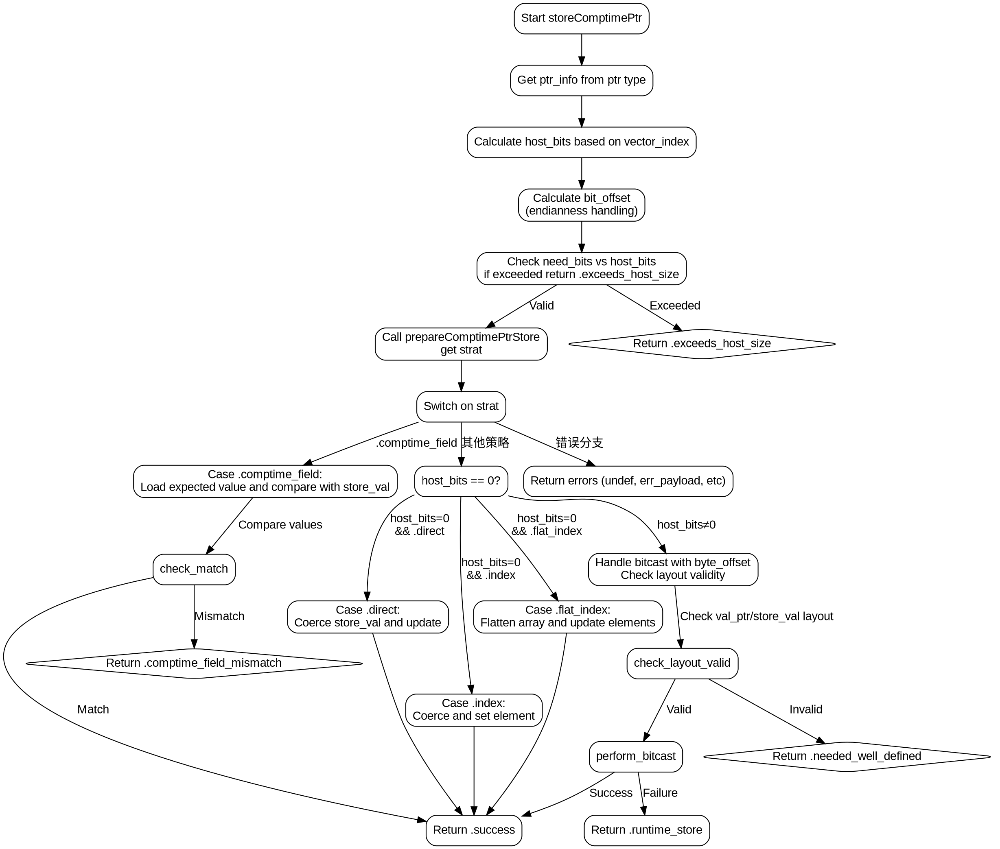

好的，我现在需要为给定的Zig函数`storeComptimePtr`绘制一个流程图。首先，我需要理解这个函数的结构和逻辑流程，这样才能准确地转化为图表。

首先，函数`storeComptimePtr`接受几个参数，包括Sema、Block、LazySrcLoc、ptr和store_val，返回一个ComptimeStoreResult。看起来这个函数处理在编译时存储指针的逻辑。

接下来，函数内部首先获取指针类型的信息`ptr_info`，并进行一些断言和计算，比如计算`host_bits`和`bit_offset`。这部分可能涉及到根据不同的条件分支处理不同的情况，比如指针是否为向量索引，以及目标架构的大小端等。

然后，函数调用`prepareComptimePtrStore`来获取存储策略`strat`，并根据不同的策略进入不同的处理分支。例如，当策略是`.comptime_field`时，会执行加载并检查存储值是否匹配的操作。其他策略如`.direct`、`.index`等也有不同的处理逻辑。

在后续的代码中，存在多个条件分支，比如检查`host_bits`是否为0，不同的策略类型（direct、index、flat_index、reinterpret）对应不同的处理方式。此外，还有一些错误处理和结果返回的情况，比如返回`.runtime_store`、`.undef`等。

绘制流程图时，需要将这些逻辑分支清晰地表示出来。可能需要从函数入口开始，按照代码的执行顺序，将每个条件判断和处理步骤转化为流程图的节点和分支。例如：

1. 函数开始，获取`ptr_info`，计算`host_bits`和`bit_offset`。
2. 调用`prepareComptimePtrStore`得到`strat`。
3. 根据`strat`的不同值，进入不同的处理分支。
4. 对于`.comptime_field`的情况，加载值并比较是否匹配。
5. 检查`host_bits`是否为0，决定是否直接存储或进行位转换。
6. 处理不同的存储策略（direct、index等），并进行相应的数据操作。
7. 错误处理和返回结果。

需要注意的是，代码中存在多个返回点，每个返回点对应不同的结果，如`.success`、`.runtime_store`等，这些都需要在流程图中明确标出。

此外，在代码的后面部分，当`host_bits`不为0时，需要进行位转换操作，这部分可能涉及到更多的条件判断和操作步骤，也需要在流程图中体现。

最后，需要确保流程图的每个节点和分支都有清晰的标签，说明其对应的代码逻辑，避免遗漏任何重要的判断或处理步骤。
================================================

该流程图使用Graphviz DOT语言绘制，主要特点：
1. 使用黄色菱形节点表示错误/特殊返回路径
2. 绿色圆角矩形表示正常处理路径
3. 红色边框节点表示关键判断点
4. 使用自然语言标签保持与代码逻辑对应
5. 包含了所有主要分支路径（comptime_field处理、host_bits判断、位转换操作等）
6. 使用分层结构展现代码逻辑流
7. 保留了Zig代码中的关键变量名和类型检查逻辑