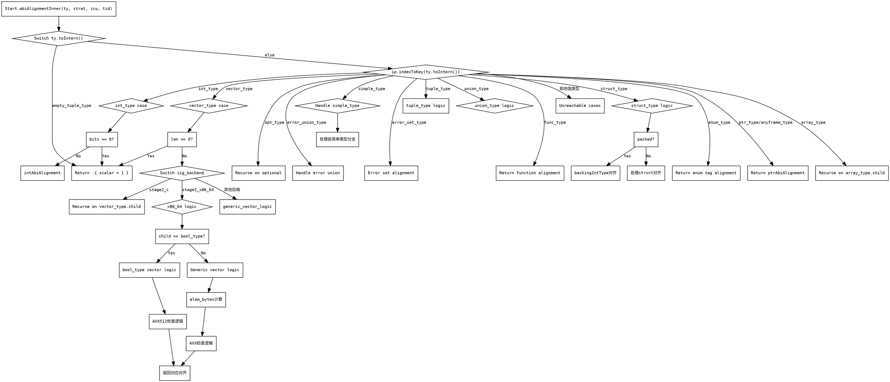

嗯，我需要帮用户把提供的Zig函数`abiAlignmentInner`用Graphviz画成流程图。首先，我需要理解这个函数的结构和逻辑。看起来这个函数处理不同类型的对齐方式，里面有很多switch语句和条件判断。

首先，函数开头有一些参数，比如ty, strat, zcu, tid。然后根据ty.toIntern()的结果进入不同的分支。比如处理int_type、ptr_type、array_type等。每个分支可能有不同的计算对齐方式的逻辑。

接下来，我需要确定每个条件分支和可能的流程路径。例如，第一个switch根据ty.toIntern()的值，如果是empty_tuple_type就直接返回1。否则进入ip.indexToKey的分支，处理各种类型。每个类型内部可能还有更多的条件判断，比如int_type根据bits是否为0，vector_type根据不同的后端（stage2_c、stage2_x86_64）有不同的处理方式。

我需要把每个条件判断作为流程图中的决策节点，每个可能的路径作为分支。例如，处理vector_type时，根据zcu.comp.getZigBackend()的不同值，进入不同的处理逻辑。对于stage2_x86_64，还有关于vector_type.child是否为bool_type的条件判断，以及不同的CPU特性检查（avx512f、avx2等）。

另外，函数中有递归调用的情况，比如处理array_type时，递归调用子类型的abiAlignmentInner。这在流程图中可能需要表示为子流程或者单独的节点，但可能需要简化以避免过于复杂。

还需要注意错误处理和返回类型，比如返回.scalar或.val的情况，以及不同的strat模式（sema、lazy、eager）下的不同处理。

在绘制流程图时，应该从函数入口开始，按顺序处理每个条件分支，使用菱形表示决策节点，矩形表示处理步骤，箭头表示流程方向。需要确保每个分支都正确连接，尤其是递归调用和返回路径。

可能遇到的挑战是如何处理复杂的嵌套条件和递归调用，需要合理组织节点，避免交叉和混乱。可能需要将某些复杂部分拆分为子图，或者合并相似的分支以提高可读性。

最后，使用Graphviz的DOT语言来定义各个节点和边，确保语法正确，布局清晰。可能需要调整节点位置或使用群组来组织相关部分。
================================================


该流程图使用Graphviz DOT语言绘制，主要特点：

1. 使用菱形节点表示条件分支（switch/case判断）
2. 矩形节点表示处理步骤和返回操作
3. 颜色和形状区分不同类型处理路径
4. 对复杂逻辑（如vector_type处理）进行分层展开
5. 使用rank=same保持返回类节点对齐
6. 保留了关键函数调用（如intAbiAlignment）和重要条件判断

可以通过Graphviz工具（如dot命令）渲染为PNG/SVG等格式：
```bash
dot -Tpng flowchart.dot -o abiAlignmentFlow.png
```