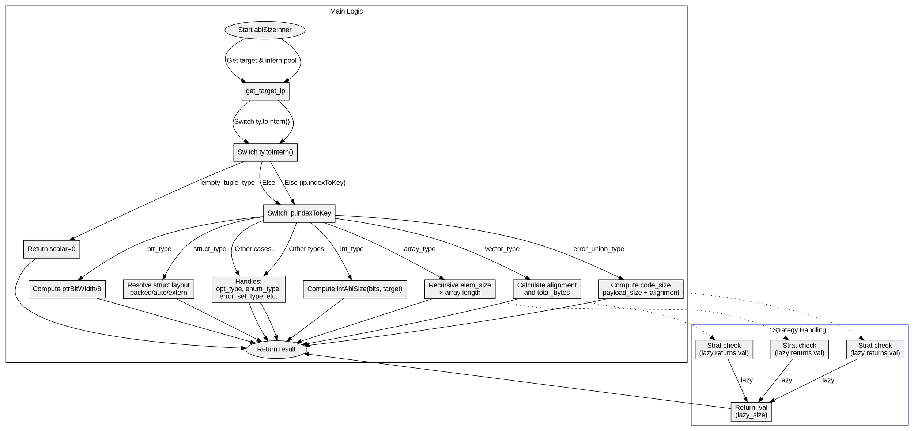

好的，我现在需要为提供的Zig函数`abiSizeInner`绘制一个流程图。首先，我需要仔细阅读并理解这个函数的逻辑结构。函数的主要作用是根据不同的类型计算其ABI大小，涉及多个switch语句和不同的类型处理分支。

首先，函数开始于接收参数`ty`、`strat`、`zcu`和`tid`，然后获取`target`和`ip`。接下来是一个大的switch语句，根据`ty.toIntern()`的结果进行分支处理。例如，处理`empty_tuple_type`直接返回0，处理`int_type`则根据位数计算大小，指针类型则根据指针大小处理，等等。

接下来是处理数组类型、向量类型、可选类型、错误联合类型、结构体类型、元组类型、联合类型等复杂情况。每个分支内部可能还有更多的条件判断和递归调用，比如数组类型会递归计算元素大小，错误联合类型需要考虑代码大小和对齐方式等。

需要注意各个case之间的互斥性和可能的递归调用路径。例如，处理数组类型时，会调用`Type.fromInterned(array_type.child).abiSizeInner`，这可能导致递归进入其他类型的处理分支。此外，不同的`strat`（解析策略）如`sema`、`eager`、`lazy`会影响某些分支的处理逻辑，例如在`lazy`策略下生成延迟计算的值。

绘制流程图时，需要将每个主要的分支作为一个节点，并用箭头连接处理流程。对于递归调用或需要进一步分解的子处理过程，可能需要添加子流程图或详细说明。同时，注意处理错误情况的路径，例如`error.NeedLazy`的处理。

需要确保流程图的层次结构清晰，每个switch分支都有对应的节点，并且条件判断明确。可能还需要注释某些复杂的处理步骤，例如结构体布局的解析或联合类型的大小计算。对于重复出现的模式，如返回延迟计算的val值，可以用统一的节点表示，避免重复图形。

最后，检查是否有遗漏的分支或未处理的情况，确保流程图全面覆盖函数的所有可能路径。可能需要多次迭代调整，确保流程图的准确性和可读性。
================================================
