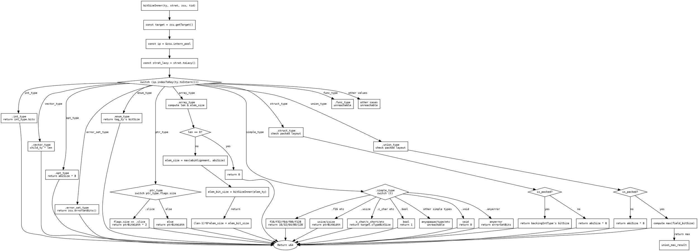

嗯，用户让我用Graphviz来画这个Zig函数的流程图。首先，我需要理解这个函数的结构。函数bitSizeInner处理不同类型，返回它们的位大小。代码中有很多switch语句，处理不同的类型情况，比如int_type、ptr_type、array_type等等。每个case里面可能还有递归调用或者其他计算。

首先，我应该确定函数的主干流程。函数开始获取target和ip，然后根据类型的不同进入不同的分支。每个分支可能有不同的处理逻辑，比如直接返回值、递归调用bitSizeInner，或者计算组合类型的位大小。

接下来，我需要将每个switch case转化为流程图的节点和分支。例如，处理int_type时直接返回bits，这可以表示为一个决策节点，然后到结束节点。处理array_type时则需要计算元素大小和长度，可能涉及递归调用，这需要更详细的子流程。

需要注意的是，有些分支会导致递归调用，比如array_type中的elem_ty.bitSizeInner，这应该在流程图中表示为一个子过程或者循环。但Graphviz不支持子程序图，可能需要用节点和边来表示递归调用点。

另外，代码中有多个return语句，每个case都可能直接返回，所以每个分支都应该有对应的终止节点。同时，错误处理（比如SemaError）可能需要单独的路径，但代码中使用的是try，可能隐含错误传递，但用户可能不需要显示错误处理的流程，除非特别要求。

还要处理一些复杂的结构，比如struct_type和union_type，它们有额外的条件判断，比如is_packed，这会产生不同的计算路径。这些条件需要作为决策节点，分出不同的分支。

可能遇到的挑战是如何简洁地表示递归调用和嵌套的条件判断，同时保持流程图的可读性。需要合理分组节点，避免交叉连线过多。另外，一些unreachable的情况可能需要单独标注，但用户可能不需要详细展示这些。

最后，确保使用正确的Graphviz语法，定义各个节点和边，使用合适的形状（如菱形表示决策，矩形表示过程，椭圆形表示开始/结束等）。可能需要将整个函数分解为多个子图，但Graphviz的subgraph主要用于视觉分组，不影响布局，所以可能保持为一个主图，通过节点层次来组织。
================================================
