嗯，我需要为这个Zig函数`comptimeOnlyInner`生成一个Graphviz的流程图。首先，我得理解这个函数的结构。看起来这是一个递归函数，用于检查某个类型是否只能在编译时存在。函数内部有很多switch语句，处理不同类型的各种情况。

首先，函数的入口是`pub fn comptimeOnlyInner(...)`，然后开始处理不同的类型情况。第一个switch是根据`ty.toIntern()`的结果，其中`.empty_tuple_type`直接返回false。其他的情况进入另一个switch，处理不同的类型键，比如int_type、ptr_type、array_type等。

对于指针类型（ptr_type），它会检查子类型是否是函数或opaque，然后递归调用。结构体类型（struct_type）和联合类型（union_type）有更复杂的处理逻辑，尤其是当strat是sema时需要解析字段。元组类型（tuple_type）会遍历每个字段检查是否有comptime_only的情况。

我需要将每个条件分支转化为流程图中的节点和边。注意递归调用的情况，比如处理ptr_type时调用child_ty.comptimeOnlyInner，这时候可能需要一个子流程或者循环的节点。不过Graphviz的流程图通常是平面的，所以可能需要用节点来表示递归调用点。

另外，函数中有多个return语句，每个case处理完后返回true或false。我需要确保每个分支都有正确的流向，尤其是错误处理和条件判断。比如struct_type处理中，有strat.normal和strat.sema的不同路径，需要分别画出。

还要注意一些特殊情况，比如unreachable的情况，可能在流程图中标记为终止节点或者注释。例如，当遇到`.func_type`时返回true，而其他如undef等则会触发unreachable。

在画图时，可能需要将主要的switch分支作为决策节点，然后每个case作为子节点。对于递归调用，可以用一个节点指向自身或者另一个处理子类型的节点。需要保持流程图的清晰，避免交叉线过多，可能使用子图来分组不同类型的处理逻辑。

最后，确保所有的返回路径都被覆盖，包括错误处理和正常返回。可能需要多次检查代码，确保每个分支都有对应的流程节点，并且连接正确。
================================================

```graphviz
digraph comptimeOnlyInner {
    graph [fontname="Arial", nodesep=0.5, ranksep=0.5];
    node [fontname="Arial", shape=rectangle, style=filled, fillcolor="#f0f0f0"];
    edge [fontname="Arial"];

    start [label="Start comptimeOnlyInner(ty, strat, zcu, tid)", shape=ellipse, fillcolor="#b3e2cd"];
    end [label="Return bool", shape=ellipse, fillcolor="#fdccac"];

    subgraph cluster_main {
        label="Main Logic";
        color=transparent;

        switch_ty [label="Switch ty.toIntern()", shape=diamond];
        empty_tuple [label="case .empty_tuple_type\nreturn false"];
        default_ty [label="default", shape=diamond];

        switch_ip_key [label="Switch ip.indexToKey()", shape=diamond];
        int_type [label="case .int_type\nreturn false"];
        ptr_type [label="case .ptr_type"];
        anyframe_type [label="case .anyframe_type"];
        array_type [label="case .array_type"];
        vector_type [label="case .vector_type"];
        opt_type [label="case .opt_type"];
        error_union_type [label="case .error_union_type"];
        error_set_types [label="case .error_set_type/.inferred_error_set_type\nreturn false"];
        func_type [label="case .func_type\nreturn true"];
        simple_type [label="case .simple_type"];
        struct_type [label="case .struct_type"];
        tuple_type [label="case .tuple_type"];
        union_type [label="case .union_type"];
        opaque_type [label="case .opaque_type\nreturn false"];
        enum_type [label="case .enum_type"];
        unreachable_cases [label="cases: .undef/.simple_value/etc.\nunreachable"];

        // PTR_TYPE subflow
        ptr_child_check [label="Check child_ty.zigTypeTag()", shape=diamond];
        ptr_child_fn [label=".fn: return !fnHasRuntimeBits"];
        ptr_child_opaque [label=".opaque: return false"];
        ptr_child_else [label="else: recurse child_ty"];

        // SIMPLE_TYPE subflow
        simple_switch [label="Switch simple_type variant", shape=diamond];
        simple_runtime [label="f16/f32/.../noreturn\nreturn false"];
        simple_comptime [label="type/comptime_int/...\nreturn true"];

        // STRUCT_TYPE subflow
        struct_layout_check [label="if (struct_type.layout == .packed)\nreturn false", shape=diamond];
        strat_normal [label="strat.normal\ncheck requiresComptime"];
        strat_sema [label="strat.sema\nresolve fields and check"];
        
        // TUPLE_TYPE subflow
        tuple_loop [label="Loop through tuple fields\nif any field needs comptime: return true"];
        
        // UNION_TYPE subflow
        union_strat_check [label="Switch strat", shape=diamond];
        union_normal [label="strat.normal\ncheck requiresComptime"];
        union_sema [label="strat.sema\nresolve fields and check"];
    }

    start -> switch_ty;
    switch_ty -> empty_tuple [label=".empty_tuple_type"];
    switch_ty -> default_ty [label="else"];

    default_ty -> switch_ip_key;

    switch_ip_key -> int_type [label=".int_type"];
    switch_ip_key -> ptr_type [label=".ptr_type"];
    switch_ip_key -> anyframe_type [label=".anyframe_type"];
    switch_ip_key -> array_type [label=".array_type"];
    switch_ip_key -> vector_type [label=".vector_type"];
    switch_ip_key -> opt_type [label=".opt_type"];
    switch_ip_key -> error_union_type [label=".error_union_type"];
    switch_ip_key -> error_set_types [label=".error_set_type/.inferred_error_set_type"];
    switch_ip_key -> func_type [label=".func_type"];
    switch_ip_key -> simple_type [label=".simple_type"];
    switch_ip_key -> struct_type [label=".struct_type"];
    switch_ip_key -> tuple_type [label=".tuple_type"];
    switch_ip_key -> union_type [label=".union_type"];
    switch_ip_key -> opaque_type [label=".opaque_type"];
    switch_ip_key -> enum_type [label=".enum_type"];
    switch_ip_key -> unreachable_cases [label="values (undef/.simple_value/etc.)"];

    // PTR_TYPE flow
    ptr_type -> ptr_child_check;
    ptr_child_check -> ptr_child_fn [label=".fn"];
    ptr_child_check -> ptr_child_opaque [label=".opaque"];
    ptr_child_check -> ptr_child_else [label="else"];
    ptr_child_else -> end [label="recurse child_ty"];

    // SIMPLE_TYPE flow
    simple_type -> simple_switch;
    simple_switch -> simple_runtime [label="runtime types"];
    simple_switch -> simple_comptime [label="comptime types"];
    
    // STRUCT_TYPE flow
    struct_type -> struct_layout_check;
    struct_layout_check -> strat_normal [label="non-packed"];
    struct_layout_check -> end [label="return false"];
    strat_normal -> end [label="check .requiresComptime"];
    strat_sema -> end [label="resolve fields and check"];

    // TUPLE_TYPE flow
    tuple_type -> tuple_loop -> end;

    // UNION_TYPE flow
    union_type -> union_strat_check;
    union_strat_check -> union_normal [label=".normal"];
    union_strat_check -> union_sema [label=".sema"];
    union_normal -> end [label="check .requiresComptime"];
    union_sema -> end [label="resolve fields and check"];

    // Common endpoints
    empty_tuple -> end;
    int_type -> end;
    ptr_child_fn -> end;
    ptr_child_opaque -> end;
    error_set_types -> end;
    func_type -> end;
    simple_runtime -> end;
    simple_comptime -> end;
    opaque_type -> end;
    enum_type -> end [label="recurse tag_ty"];
    unreachable_cases -> end [style=dashed];
}
```
