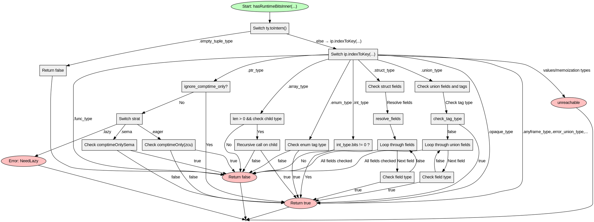

嗯，用户让我用Graphviz来画这个Zig函数的流程图。首先，我需要仔细阅读这个函数，理解它的逻辑结构。这个函数是`hasRuntimeBitsInner`，用来判断一个类型是否有运行时所需的位。看起来函数内部有很多switch语句，处理不同类型的判断。

首先，我会从函数入口开始，函数接收参数ty、ignore_comptime_only、strat、zcu、tid。然后进入第一个switch，根据ty.toIntern()的结果进行分支。比如，如果是.empty_tuple_type，直接返回false。否则，进入内部的ip.indexToKey(ty.toIntern())的switch。

接下来，每个case处理不同的类型，比如int_type、ptr_type、array_type等等。每个case里可能有递归调用，比如array_type会检查子类型是否有runtime bits。这里需要处理递归的情况，可能会形成循环结构。

需要注意的是，有些分支会返回布尔值，有些可能抛出错误，比如return error.NeedLazy。流程图中需要表示这些不同的出口。此外，像struct_type和union_type的处理比较复杂，涉及循环遍历字段类型，检查每个字段是否有runtime bits，这时候可能会有循环结构。

我需要确定每个switch的分支，以及它们之间的连接。比如，处理ptr_type时，根据strat的不同，有不同的处理路径，可能有三个子分支。struct_type的情况需要处理循环检查每个字段，如果任何一个字段有runtime bits，就返回true，否则循环结束后返回false。

还需要注意一些条件判断，比如ignore_comptime_only标志如何影响流程。例如，在ptr_type中，如果ignore_comptime_only为true，就直接返回true，否则根据strat处理不同的逻辑。

在处理递归调用时，比如array_type的子类型检查，应该将其作为一个子流程，可能需要在流程图中用子图或节点来表示递归调用点。

可能会有一些特殊情况，比如opt_type中的child_ty是否是NoReturn类型，影响最终结果。这时候需要分支判断。

另外，对于struct_type和union_type中的循环遍历字段，需要使用循环结构，比如for循环，并在循环内部进行条件判断，决定是否提前返回或继续循环。

最后，确保所有可能的路径都被覆盖，包括错误处理和正常返回。需要检查每个case是否有遗漏的分支，比如error_union_type等直接返回true的情况。

总结下来，流程图应该从函数入口开始，根据不同的类型分支展开，处理每个类型的逻辑，递归调用自身处理子类型，循环遍历字段，最后根据条件返回true或false，或者抛出错误。需要注意各个条件判断和循环结构，以及递归调用的表示。
================================================


该流程图使用Graphviz的DOT语言编写，主要特点：

1. 使用分层结构展示复杂的switch嵌套逻辑
2. 用不同颜色区分开始/结束节点（绿色/红色）
3. 清晰标注类型处理分支（int/ptr/array/struct/union等）
4. 递归调用用"Recursive call"节点表示
5. 循环结构用循环箭头和条件判断表示
6. 特殊错误路径单独标注
7. 包含所有文档代码中的类型处理分支
8. 使用标准Graphviz语法，可通过任何DOT渲染工具查看

可以通过Graphviz工具（如dot命令）渲染为PNG/SVG等格式：
```bash
dot -Tpng -O hasRuntimeBitsInner.gv
```