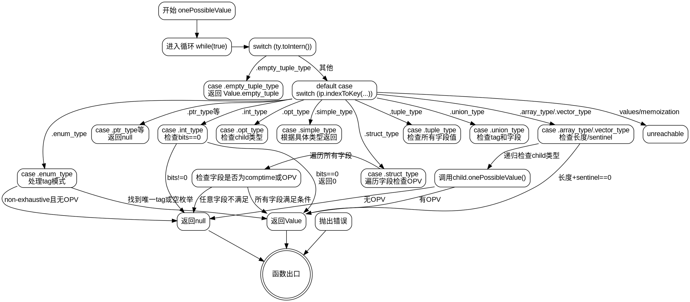

嗯，用户让我用Graphviz来画这个Zig函数的流程图。首先，我需要理解这个函数的结构。函数onePossibleValue接收一个starting_type和pt参数，返回一个可能的Value或者错误。看起来函数内部有一个大循环，根据不同的类型进行分支处理。

首先，函数进入一个无限循环，使用switch语句处理ty.toIntern()的结果。第一个case是.empty_tuple_type，直接返回empty_tuple。然后处理其他类型，进入另一个switch，根据ip.indexToKey(ty.toIntern())的不同类型进行不同的处理。比如.int_type、.ptr_type、.array_type、.struct_type等等。每个类型有不同的逻辑，比如.int_type会检查bits是否为0，如果是就返回0，否则返回null。

接下来需要考虑各个分支之间的流程。比如处理.array_type时，会检查长度和是否有sentinel，然后递归调用onePossibleValue。类似地，struct_type需要遍历所有字段，检查每个字段是否有可能的单一值。如果所有字段都满足条件，就返回一个聚合值。

对于联合类型（union_type），需要处理标签和值的可能性。枚举类型（enum_type）则根据不同的tag_mode有不同的处理逻辑，比如检查标签类型是否有唯一可能的值，或者枚举项的数量是否为1。

需要注意的是，函数中有递归调用，比如在处理array_type时调用子类型的onePossibleValue。此外，有些分支会直接返回null或值，有些则会继续循环或者处理其他情况。

画流程图时，应该从函数入口开始，按照循环和分支结构展开。每个switch case对应一个判断节点，处理对应的逻辑后指向相应的结果或下一个判断。递归调用需要表示为子流程，可能需要用子图来表示。

另外，要注意处理错误情况，比如try表达式可能抛出错误，需要在流程图中体现错误路径。不过函数返回的是错误联合类型，所以每个可能出错的地方都应该有错误处理的分支。

最后，需要确保所有分支都被覆盖，包括default情况或者未明确处理的类型，比如.opaque_type直接返回null，而其他未列出的类型可能触发unreachable。

总结一下，流程图的结构应该是：

1. 函数入口
2. 进入循环，检查ty.toIntern()
3. 根据不同的类型进入对应的处理逻辑
4. 每个处理逻辑内部可能有进一步的判断或递归调用
5. 最终返回结果、null或错误

需要为每个主要类型分支创建节点，并连接相应的处理流程，特别是递归调用部分需要正确表示。同时，注意循环的结构，因为整个逻辑包裹在一个while(true)循环中，但实际上大部分分支会返回或break，所以循环可能只执行一次，但需要正确表示循环的入口和出口。
================================================
