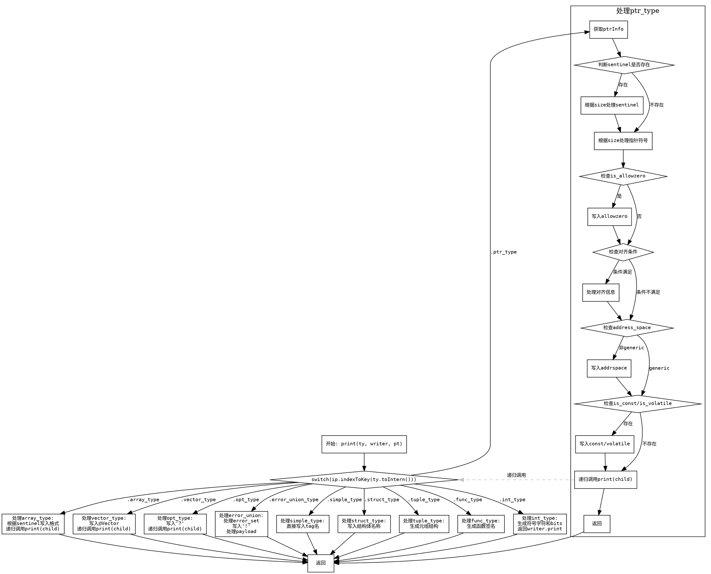

嗯，我需要帮用户用Graphviz画出一个Zig函数的流程图。这个函数看起来挺复杂的，有很多switch case和处理不同类型的情况。首先，我得仔细阅读代码，理解每个分支的逻辑，然后确定主要的流程节点和它们之间的关系。

首先，函数名是print，接收一个类型、writer和pt参数。然后进入switch语句，根据不同的类型进行处理。每个case对应不同的类型处理，比如int_type、ptr_type、array_type等等。每个case里面可能有递归调用print函数，比如在处理ptr_type时，最后会递归调用print处理child类型。

我需要确定每个case的处理步骤，并转化为流程图中的节点。比如，int_type会生成一个符号字符和位数，然后输出。ptr_type处理指针信息，可能根据不同的size输出不同的格式，比如[*:sentinel]或[*]，然后处理对齐、地址空间等属性，最后递归处理child类型。

接下来要考虑递归调用的情况，这时候流程图可能会有循环或重复的节点。比如，处理ptr_type后调用print(child)，这里可能需要一个指向开始节点的箭头，表示递归。

然后，需要考虑各个分支的条件判断，比如if语句，例如判断sentinel是否存在，不同的size类型，这些条件在流程图中应该表示为不同的决策节点，分出不同的路径。

另外，函数中有很多错误处理，比如try writer.print，这些可能涉及到错误传播，但根据函数签名，错误会被返回，所以可能不需要在流程图中特别处理错误路径，除非用户特别要求。

需要注意的是，Graphviz的语法是用节点和边来表示流程。每个处理步骤作为一个节点，条件判断作为菱形节点，边上的标签表示条件。可能需要将大的switch case分解成多个子流程，或者保持整体结构，避免过于复杂。

可能的步骤：
1. 开始节点：函数入口。
2. 进入switch，根据ip.indexToKey的结果分支到不同的类型处理。
3. 每个类型处理作为一个子流程，比如int_type分支、ptr_type分支等。
4. 在每个分支内部，处理具体的逻辑，可能有条件判断和递归调用。
5. 递归调用print时，可能需要连接到开始的switch节点，或者单独表示递归。
6. 结束节点：返回void。

可能需要简化，因为代码非常长，如果每个case都详细画出来，流程图会非常庞大。用户可能需要一个概览，而不是每个细节。或者，按照用户的要求，尽可能详细。

另外，注意不要使用mermaid，而是用Graphviz的dot语言。需要确保节点和边的正确连接，条件分支正确标注。

现在，开始组织各个case的结构，确定主要节点和连接方式。例如，处理ptr_type时，先处理sentinel和size，然后是flags，对齐，地址空间等，最后递归处理child。每个步骤作为节点，条件判断作为分支。

可能的问题：如何处理递归调用？在流程图中，可能需要用一个子图来表示递归，或者用节点指向之前的处理节点。例如，在ptr_type处理结束后，有一个节点“递归调用print(child)”，然后边指向最开始的switch节点。

此外，函数中有多个return语句，需要确保流程的正确终止。每个case处理完后可能有return，或者继续执行其他代码。

需要仔细检查每个case是否有return，比如int_type处理完后直接return，而ptr_type处理完后调用print(child)然后return。因此，每个case的流程可能不同。

最终，需要将整个函数的逻辑分解成Graphviz的节点和边，确保逻辑正确，结构清晰。
================================================

该流程图：
1. 使用矩形节点表示操作步骤，菱形节点表示条件判断
2. 主switch分支覆盖了代码中所有主要类型处理case
3. ptr_type分支使用子图详细展示了指针类型的处理流程
4. 递归调用用虚线箭头表示回到主switch节点
5. 简略表示了其他常见类型分支（如simple_type、struct_type等）
6. 保留了关键判断条件和主要写入操作