好的，我需要为给定的Zig函数`pointerDerivationAdvanced`生成一个Graphviz流程图。首先，我需要理解这个函数的结构和逻辑流程。

函数开始于获取`ptr_val`的指针信息，然后根据`ptr.base_addr`的不同情况进行处理，每个情况对应不同的`PointerDeriveStep`。接着处理`ptr.byte_offset`和类型调整，可能会有递归调用。最后，根据条件判断返回不同的结果。

流程图的大致步骤应该是：

1. 函数入口点。
2. 处理`ptr.base_addr`的各种情况（如int, nav, uav等），每个情况生成对应的步骤。
3. 处理偏移量`byte_offset`和类型调整，可能需要进入循环结构。
4. 根据条件判断是否直接返回`base_derive`或继续处理。
5. 处理`need_child`和`need_bytes`，进入可能的循环细化步骤（如数组、结构体字段等）。
6. 最后判断是否可以直接返回`cur_derive`，否则创建`offset_and_cast`步骤。

需要注意的是递归调用的情况，比如在处理`eu_payload`或`opt_payload`时，会递归调用自身。此外，循环结构如`while (true)`需要正确表示。

需要将这些逻辑步骤转化为Graphviz的节点和边，确保条件分支正确连接。可能使用菱形节点表示条件判断，矩形节点表示处理步骤，箭头表示流程方向。同时，递归调用可能需要用子图或注释标明。
================================================

```dot
digraph pointerDerivationAdvanced {
    node [shape=rectangle, fontname="Courier", fontsize="10"];
    edge [fontname="Courier", fontsize="10"];

    start [label="Start: pointerDerivationAdvanced(ptr_val, arena, pt, resolve_types, opt_sema)"];
    get_ptr [label="Get ptr from ptr_val"];
    switch_base_addr [label="Switch ptr.base_addr", shape=diamond];
    case_int [label="Case .int:\nReturn .int step"];
    case_nav [label="Case .nav:\nReturn .nav_ptr step"];
    case_uav [label="Case .uav:\nCreate const_ty\nReturn .uav_ptr step"];
    case_comptime_alloc [label="Case .comptime_alloc:\nGet alloc\nReturn .comptime_alloc_ptr step"];
    case_comptime_field [label="Case .comptime_field:\nReturn .comptime_field_ptr step"];
    case_eu_payload [label="Case .eu_payload:\nRecursive call\nReturn .eu_payload_ptr step"];
    case_opt_payload [label="Case .opt_payload:\nRecursive call\nReturn .opt_payload_ptr step"];
    case_field [label="Case .field:\nResolve field info\nRecursive call\nReturn .field_ptr step"];
    case_arr_elem [label="Case .arr_elem:\nRecursive call\nReturn .elem_ptr step"];
    check_offset_ty [label="Check ptr.byte_offset == 0\nand ty matches base_derive?", shape=diamond];
    return_base_derive [label="Return base_derive"];
    handle_need_child [label="Check need_child.comptimeOnly"];
    create_offset_cast [label="Create offset_and_cast step"];
    refine_loop [label="Refinement loop", shape=diamond];
    check_cur_ty [label="Check cur_ty == need_child\nand cur_offset == 0", shape=diamond];
    handle_optional [label="Handle optional type", shape=diamond];
    handle_array [label="Handle array type"];
    handle_struct [label="Handle struct type"];
    final_check [label="Final compatibility check", shape=diamond];
    return_cur_derive [label="Return cur_derive"];
    return_offset_cast [label="Return offset_and_cast step"];

    start -> get_ptr;
    get_ptr -> switch_base_addr;
    switch_base_addr -> case_int [label=".int"];
    switch_base_addr -> case_nav [label=".nav"];
    switch_base_addr -> case_uav [label=".uav"];
    switch_base_addr -> case_comptime_alloc [label=".comptime_alloc"];
    switch_base_addr -> case_comptime_field [label=".comptime_field"];
    switch_base_addr -> case_eu_payload [label=".eu_payload"];
    switch_base_addr -> case_opt_payload [label=".opt_payload"];
    switch_base_addr -> case_field [label=".field"];
    switch_base_addr -> case_arr_elem [label=".arr_elem"];
    
    case_eu_payload -> case_eu_payload [label="Recursive call", style=dashed];
    case_opt_payload -> case_opt_payload [label="Recursive call", style=dashed];
    case_field -> case_field [label="Recursive call", style=dashed];
    case_arr_elem -> case_arr_elem [label="Recursive call", style=dashed];

    switch_base_addr -> check_offset_ty [label="All cases processed"];
    check_offset_ty -> return_base_derive [label="Yes"];
    check_offset_ty -> handle_need_child [label="No"];
    handle_need_child -> create_offset_cast [label="comptimeOnly"];
    handle_need_child -> refine_loop [label="Else"];
    
    refine_loop -> check_cur_ty;
    check_cur_ty -> refine_loop [label="Continue loop"];
    check_cur_ty -> handle_optional [label="Break loop"];
    
    handle_optional -> handle_array [label="Not optional"];
    handle_optional -> handle_optional [label="Process optional"];
    handle_array -> handle_struct [label="Not array"];
    handle_struct -> refine_loop [label="Struct processed"];
    
    refine_loop -> final_check [label="Loop exit"];
    final_check -> return_cur_derive [label="Compatible"];
    final_check -> return_offset_cast [label="Not compatible"];
}
```
